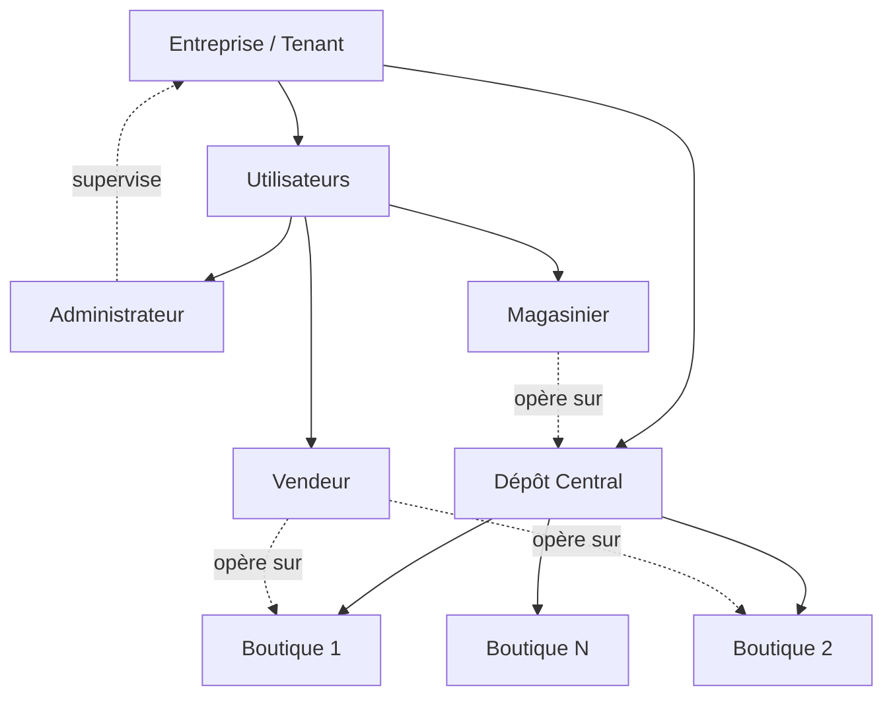
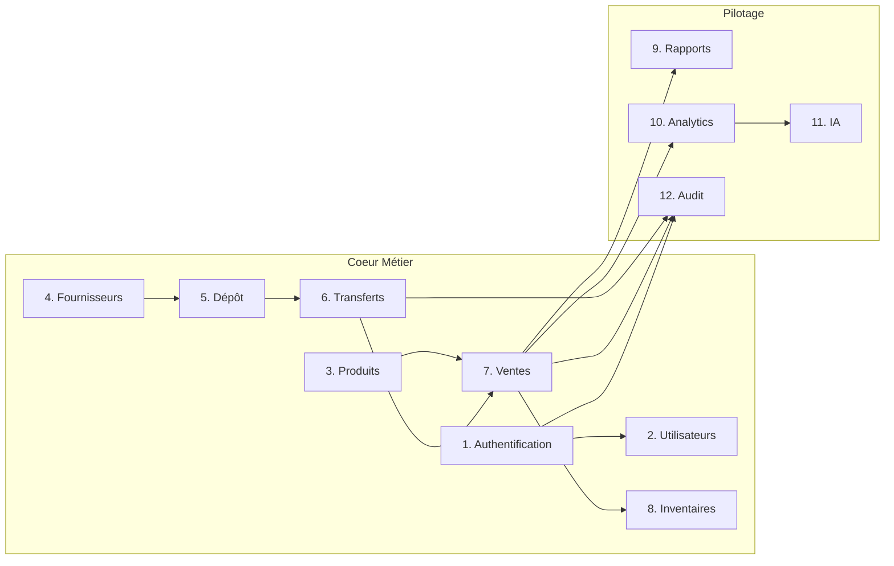
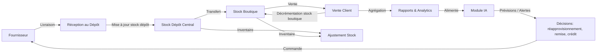
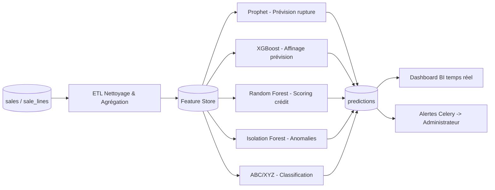

# 5. Architecture fonctionnelle

## 5.1 Organisation hiérarchique

```text
Entreprise (Tenant)
    |
    +-- Dépôt Central (unique)
            |
            +-- Boutique 1
            +-- Boutique 2
            +-- Boutique N
```



## 5.2 Cartographie des modules



| # | Module | Description | Acteurs principaux |
|---|---|---|---|
| 1 | Authentification | Login, JWT, gestion de session, multi-tenant | Tous |
| 2 | Utilisateurs | Gestion des comptes, rôles, permissions (RBAC) | Administrateur |
| 3 | Produits | Catalogue, catégories, marques, tarifications | Administrateur, Magasinier |
| 4 | Fournisseurs | Référentiel fournisseurs, historique achats | Magasinier, Administrateur |
| 5 | Dépôt | Stock du dépôt central, réceptions | Magasinier |
| 6 | Transferts | Mouvements dépôt ↔ boutiques | Magasinier, Administrateur |
| 7 | Ventes | Saisie des ventes, remises, crédit, offline | Vendeur |
| 8 | Inventaires | Comptages physiques, ajustements de stock | Magasinier, Vendeur (boutique) |
| 9 | Rapports | Tableaux de bord, exports PDF | Administrateur |
| 10 | Analytics | ABC/XYZ, segmentation clients, KPIs | Administrateur |
| 11 | IA | Prévisions, scoring, détection d'anomalies | Système (automatisé) + Administrateur |
| 12 | Audit | Journalisation, traçabilité, sécurité | Système + Administrateur |

## 5.3 Cycle métier global



## 5.4 Vue d'ensemble offline-first

```mermaid
flowchart TD
    subgraph Boutique (Client / PWA)
        UI[Interface Vente]
        IDB[(IndexedDB local)]
        SW[Service Worker]
    end
    subgraph Serveur
        API[API Flask]
        DB[(PostgreSQL)]
        Q[File de synchronisation]
    end
    UI -->|Vente saisie| IDB
    IDB -->|Connexion disponible| SW
    SW -->|POST /sync/sales| API
    API --> Q --> DB
    API -->|ACK / Conflits| SW
    SW -->|Mise à jour statut| IDB
    UI <-->|Lecture stock cache| IDB
```

## 5.5 Flux de données vers le module IA



## 5.6 Synthèse des interactions inter-modules

| Module source | Module cible | Donnée échangée |
|---|---|---|
| Ventes | Stock (Boutique) | Décrémentation quantité |
| Transferts | Stock (Dépôt + Boutique) | Décrémentation source / incrémentation destination |
| Fournisseurs | Stock (Dépôt) | Incrémentation à réception |
| Inventaires | Stock | Ajustement (écart) |
| Ventes | Audit | Log de vente, remise |
| Authentification | Audit | Log de connexion |
| Ventes / Stock | Analytics & IA | Données d'entraînement et features |
| IA | Rapports / Dashboard | Prévisions, scores, anomalies, alertes |
