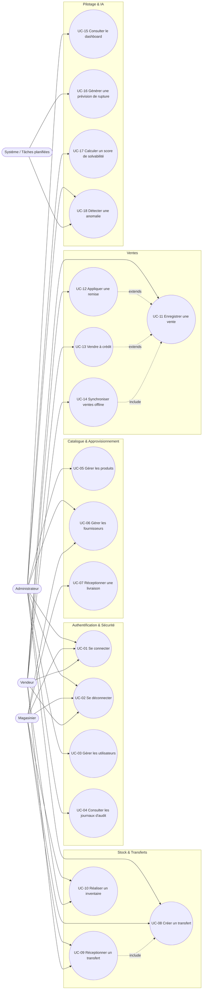

> **Dernière mise à jour :** 1er juillet 2026 — mise à jour conformité code v2.

# 6. Cas d'utilisation (Use Cases)

## 6.1 Diagramme global des cas d'utilisation

> Mermaid ne propose pas de notation UML "Use Case" native ; la représentation ci-dessous utilise un graphe orienté avec les acteurs (rectangles) et les cas d'utilisation (nœuds arrondis), regroupés par sous-système — convention couramment acceptée en substitution.

## 6.2 Fiches détaillées des cas d'utilisation principaux

### UC-01 : Se connecter

| Champ | Détail |
|---|---|
| **Acteur principal** | Tout utilisateur (Administrateur, Magasinier, Vendeur) |
| **Préconditions** | L'utilisateur possède un compte actif sur un tenant |
| **Scénario principal** | 1. L'utilisateur saisit email + mot de passe. 2. Le système vérifie les identifiants et le statut du compte. 3. Le système génère un access token (15 min) et un refresh token (7 jours), liés au `tenant_id`. 4. Si `must_change_password=True` dans le JWT, toute route protégée retourne `403 PASSWORD_CHANGE_REQUIRED` jusqu'au changement de mot de passe (RF-05, validé côté serveur). 5. Le système journalise l'événement `LOGIN_SUCCESS`. |
| **Scénarios alternatifs** | A1 : identifiants invalides → `401 Unauthorized` + log `LOGIN_FAILED`. A2 : compte désactivé → `403 Forbidden`. A3 : mot de passe temporaire non changé → `403 PASSWORD_CHANGE_REQUIRED` sur toutes les routes protégées (RF-05). |
| **Postconditions** | L'utilisateur est authentifié ; les tokens sont stockés côté client (cookie httpOnly pour le refresh, mémoire pour l'access). |
| **Exigences liées** | RF-02, RNF-09 |

### UC-08 : Créer un transfert (Dépôt → Boutique)

| Champ | Détail |
|---|---|
| **Acteur principal** | Magasinier (ou Administrateur) |
| **Préconditions** | Le stock du dépôt central est suffisant pour les quantités demandées |
| **Scénario principal** | 1. L'acteur sélectionne le site source (dépôt) et destination (boutique). 2. Il ajoute une ou plusieurs lignes produit/quantité. 3. Le système vérifie la disponibilité (RG-18). 4. Le système crée le transfert au statut `BROUILLON`, puis `EN_TRANSIT` (décrémentation du stock source — RG-17). 5. Le système journalise l'événement. |
| **Scénarios alternatifs** | A1 : stock insuffisant → message d'erreur, transfert non créé. A2 : annulation avant passage en transit → statut `ANNULE`, aucun impact stock. |
| **Postconditions** | Le transfert est visible par la boutique destinataire en statut `EN_TRANSIT`. |
| **Exigences liées** | RF-13, RF-14, RG-15 à RG-18 |

### UC-09 : Réceptionner un transfert

| Champ | Détail |
|---|---|
| **Acteur principal** | Vendeur ou Magasinier de la boutique destinataire |
| **Préconditions** | Un transfert au statut `EN_TRANSIT` est destiné au site de l'acteur |
| **Scénario principal** | 1. L'acteur consulte la liste des transferts entrants. 2. Il confirme la réception (éventuellement avec ajustement si écart constaté). 3. Le système passe le transfert au statut `RECU` et incrémente le stock destination (RG-17). 4. Le système journalise l'événement. |
| **Postconditions** | Le stock de la boutique reflète les nouveaux produits reçus. |
| **Exigences liées** | RF-14, RG-17 |

### UC-11 : Enregistrer une vente

| Champ | Détail |
|---|---|
| **Acteur principal** | Vendeur |
| **Préconditions** | Le vendeur est authentifié et rattaché à une boutique |
| **Scénario principal** | 1. Le vendeur recherche les produits (recherche tolérante aux fautes — RF-08). 2. Il ajoute les lignes (produit, quantité). 3. Le système applique automatiquement le tarif (client simple ou technicien) selon le profil client (RG-21). 4. Le vendeur valide la vente. 5. Le système vérifie la disponibilité du stock (RG-24) et décrémente le stock boutique (RF-17). 6. Le système calcule le total (RG-25) et enregistre la vente au statut `VALIDEE`. 7. Le système journalise l'événement de vente. |
| **Scénarios alternatifs** | A1 : stock insuffisant et mode en ligne → vente bloquée. A2 : mode hors-ligne → vente enregistrée localement (cf. UC-14). A3 : application d'une remise → cf. UC-12 (extension). A4 : vente à crédit → cf. UC-13 (extension). |
| **Postconditions** | Stock mis à jour, vente immuable (RG-27), reçu généré (RF-19). |
| **Exigences liées** | RF-15 à RF-17, RF-19, RG-20 à RG-27 |

### UC-12 : Appliquer une remise (extension de UC-11)

| Champ | Détail |
|---|---|
| **Acteur principal** | Vendeur, avec accord verbal de l'Administrateur |
| **Préconditions** | Une vente est en cours de saisie |
| **Scénario principal** | 1. Le vendeur sélectionne un taux de remise parmi {5 %, 10 %, 15 %, 20 %} (RG-22). 2. Le système exige la sélection de l'administrateur ayant donné son accord (`approved_by_id` — RG-23). 3. Le système recalcule le total de la vente. 4. L'événement `DISCOUNT_APPLIED` est journalisé. |
| **Scénarios alternatifs** | A1 : `approved_by_id` absent alors que `discount_rate > 0` → rejet serveur `422 VALIDATION_ERROR` (RF-16/RG-23, validé côté serveur). |
| **Exigences liées** | RF-16, RG-22, RG-23 |

### UC-13 : Vendre à crédit (extension de UC-11)

| Champ | Détail |
|---|---|
| **Acteur principal** | Vendeur |
| **Préconditions** | Le client est identifié dans le système (`customer_id`) |
| **Scénario principal** | 1. Le vendeur sélectionne "Vente à crédit". 2. Le système exige un `customer_id` (RG-26). 3. Le système affiche le score de solvabilité courant du client (issu de UC-17) à titre informatif. 4. À la validation, le solde dû du client est augmenté du montant de la vente. |
| **Exigences liées** | RF-18, RG-26, UC-17 |

### UC-14 : Synchroniser les ventes hors-ligne

| Champ | Détail |
|---|---|
| **Acteur principal** | Système (Service Worker), déclenché automatiquement |
| **Préconditions** | Des ventes existent dans la file locale IndexedDB avec statut `EN_ATTENTE_SYNC` |
| **Scénario principal** | 1. La connexion réseau est rétablie. 2. Le Service Worker envoie les ventes en attente par lot (`POST /sync/sales`) avec leur UUID local et timestamp client. 3. Le serveur traite chaque vente : vérifie le stock courant. 4. Si stock suffisant → vente `VALIDEE`. Si insuffisant → vente `EN_CONFLIT` (RG-29, RG-30). 5. Le serveur renvoie les statuts ; le client met à jour son cache local. |
| **Postconditions** | Toutes les ventes locales sont synchronisées ou marquées en conflit pour revue admin. |
| **Exigences liées** | RF-20, RG-28 à RG-30 |

### UC-16 : Générer une prévision de rupture de stock

| Champ | Détail |
|---|---|
| **Acteur principal** | Système (cron PythonAnywhere quotidien — `scripts/cron_train_all.py`) |
| **Préconditions** | Historique de ventes suffisant (≥ 60 jours recommandé) pour le couple produit/site |
| **Scénario principal** | 1. Le pipeline ETL extrait l'historique de ventes par produit/site (RG-37). 2. Le modèle Prophet génère une prévision de demande à 7-30 jours, intégrant la saisonnalité locale. 3. XGBoost affine la prévision avec variables exogènes. 4. Le système compare le stock prévisionnel au seuil minimum (RG-38). 5. Si rupture prévue, une alerte est créée et notifiée à l'Administrateur avec une quantité de commande recommandée. |
| **Exigences liées** | RF-25, RG-37, RG-38, RG-40 |

### UC-18 : Détecter une anomalie

| Champ | Détail |
|---|---|
| **Acteur principal** | Système (tâche planifiée), consultation par Administrateur |
| **Préconditions** | Des transactions récentes existent |
| **Scénario principal** | 1. Le modèle Isolation Forest analyse les ventes, remises, mouvements de stock récents. 2. Les transactions atypiques (score d'anomalie élevé) sont signalées : remise élevée sans accord administrateur tracé, vente hors horaires habituels, mouvement de stock disproportionné. 3. Une alerte est enregistrée en base et affichée au tableau de bord (polling côté frontend — SSE désactivé sur PythonAnywhere via `DISABLE_SSE=true`). |
| **Exigences liées** | RF-27, RG-23 |

## 6.3 Récapitulatif des cas d'utilisation par acteur

| Acteur | Cas d'utilisation |
|---|---|
| **Administrateur** | UC-01, UC-02, UC-03, UC-04, UC-05, UC-06, UC-08, UC-15, UC-16 (consultation), UC-17, UC-18 |
| **Magasinier** | UC-01, UC-02, UC-06, UC-07, UC-08, UC-09, UC-10 |
| **Vendeur** | UC-01, UC-02, UC-09, UC-10, UC-11, UC-12, UC-13, UC-14 |
| **Système** | UC-14, UC-16, UC-17, UC-18 |
