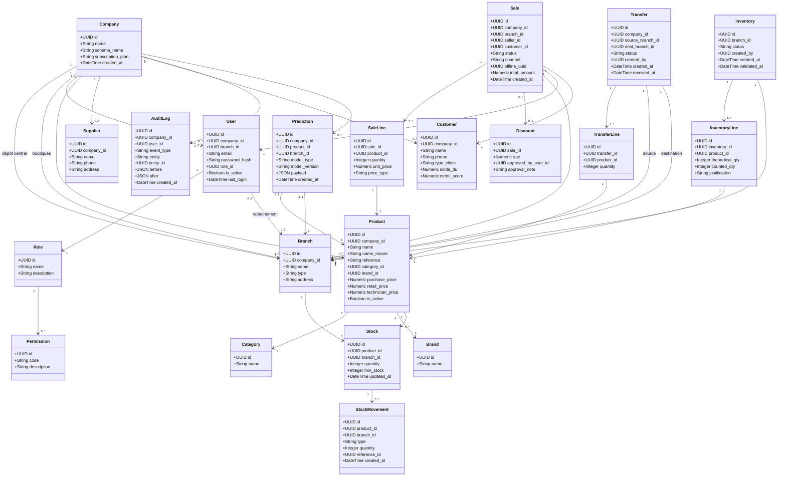
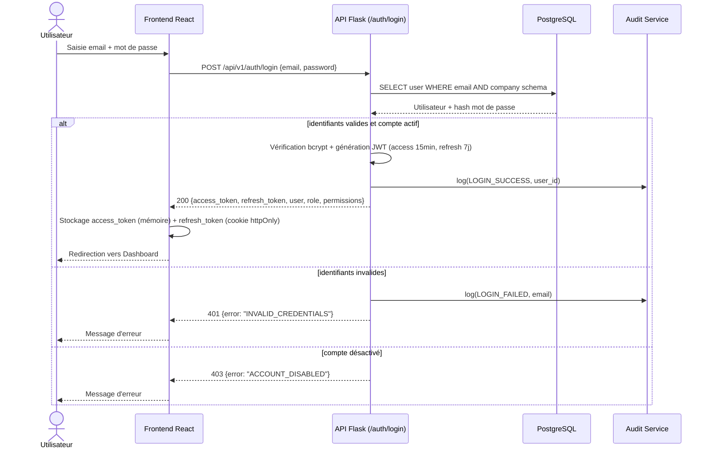
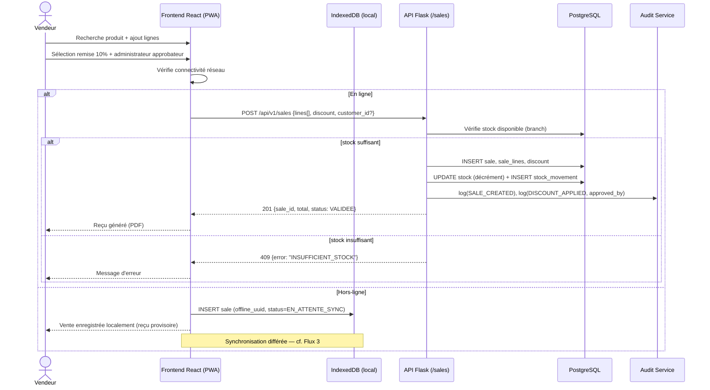
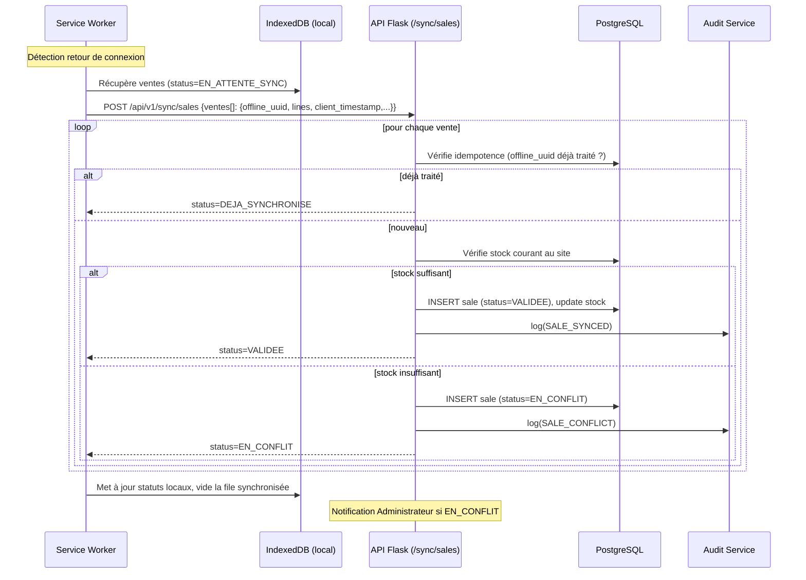
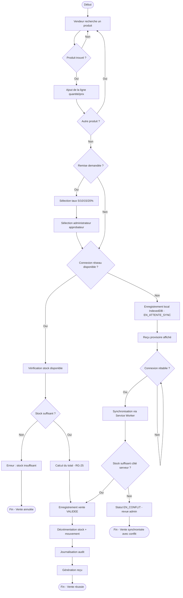
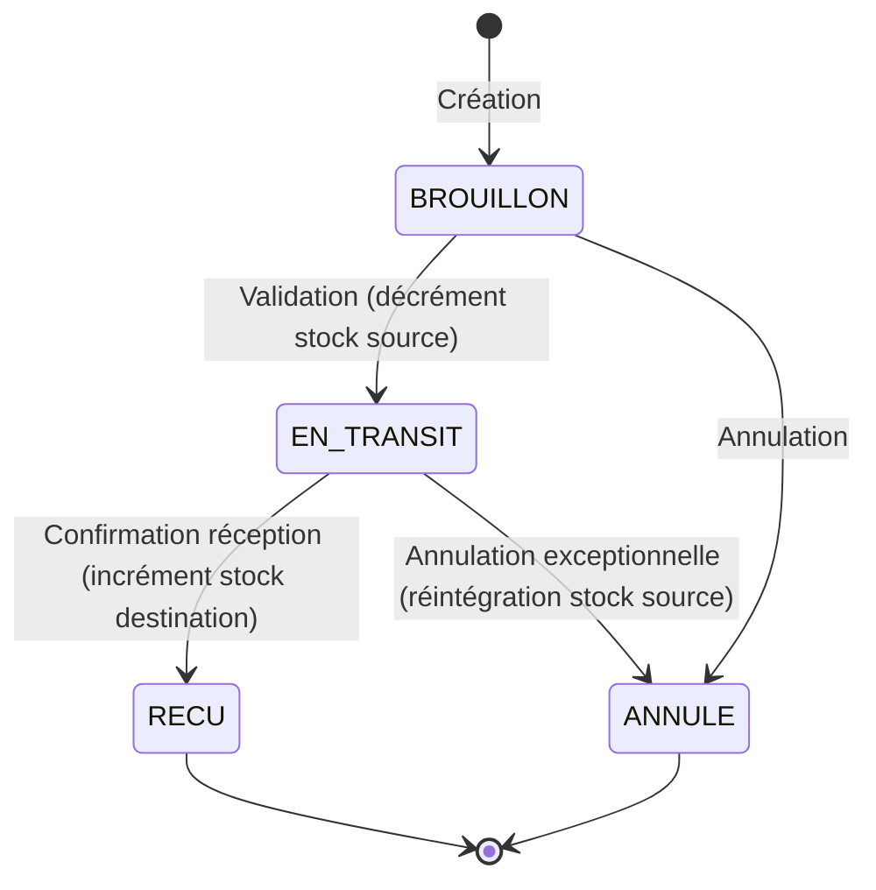
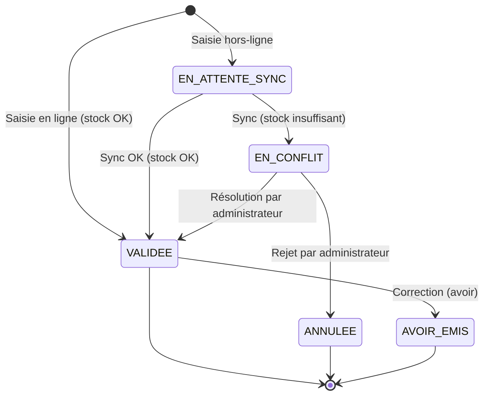
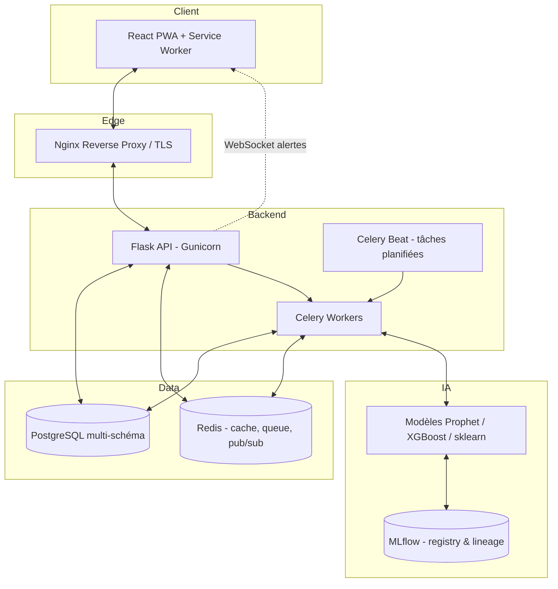

# 7. Diagrammes UML

## 7.1 Diagramme de classes

## 7.2 Diagramme de séquence — Flux 1 : Authentification (UC-01)

## 7.3 Diagramme de séquence — Flux 2 : Enregistrement d'une vente avec remise (UC-11 + UC-12)

## 7.4 Diagramme de séquence — Flux 3 : Synchronisation des ventes hors-ligne (UC-14)

## 7.5 Diagramme d'activité — Cycle de vente complet

## 7.6 Diagramme d'état — Cycle de vie d'un Transfert

## 7.7 Diagramme d'état — Cycle de vie d'une Vente

## 7.8 Diagramme de composants — Vue d'ensemble système

