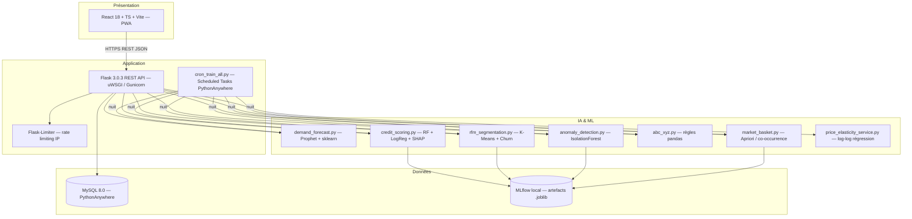
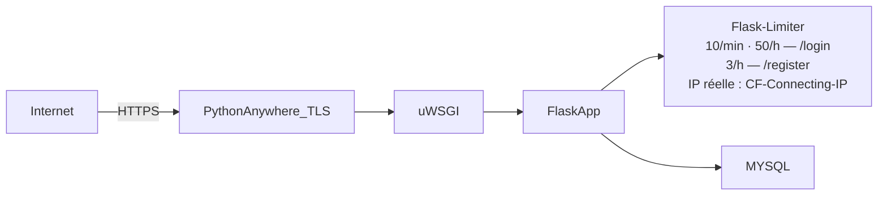
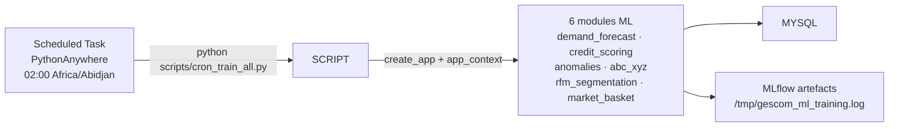
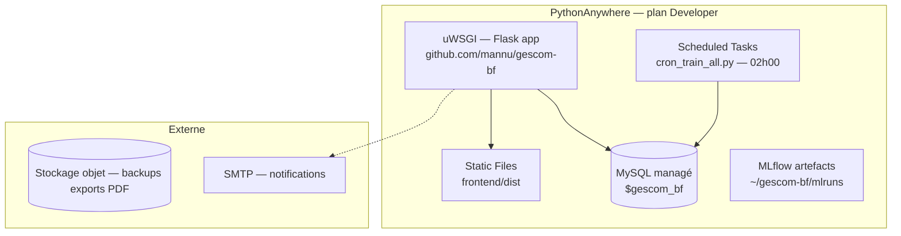
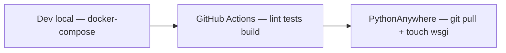

# 8. Architecture technique

> **Dernière mise à jour :** 1er juillet 2026 — mise à jour conformité code v2.

## 8.1 Vue d'ensemble

GesCom-BF est une application **3-tiers** avec une architecture **API-first** : backend Flask exposant une API REST consommée par un frontend React découplé, packagé en PWA pour le mode hors-ligne.

**Déploiement actuel :** PythonAnywhere (mono-tenant, MySQL). Une cible VPS/Docker Compose est documentée pour la V2 multi-tenant.



## 8.2 Choix technologiques

| Couche | Technologie | Version | Rôle |
|---|---|---|---|
| Frontend | React + TypeScript + Vite | 18 / 5 | SPA + PWA offline-first |
| Backend | Flask + Blueprints | 3.0.3 | API REST modulaire |
| ORM / Migrations | SQLAlchemy + Alembic | 2 / 4.0.7 | Persistance, schéma |
| Authentification | Flask-JWT-Extended | 4.6.0 | JWT access/refresh |
| Rate Limiting | Flask-Limiter | 3.8.0 | Anti-brute-force (mémoire, compatible PythonAnywhere) |
| Sérialisation | Marshmallow + Flask-Marshmallow | 3.21.3 / 1.2.1 | Validation entrées/sorties |
| Base de données (prod) | MySQL 8.0 — PythonAnywhere | — | Mono-tenant, driver PyMySQL |
| Base de données (dev) | PostgreSQL 16 — Docker | — | Multi-tenant (V2) |
| Tâches planifiées (prod) | `scripts/cron_train_all.py` | — | Entraînements ML nocturnes via Scheduled Tasks |
| Tâches planifiées (dev) | Threads Python natifs | — | Entraînements ML asynchrones (Celery supprimé) |
| ML principal | scikit-learn | 1.5.1 | RF, IsolationForest, K-Means, LinearRegression |
| Prévision temporelle | Prophet | 1.1.5 | Séries temporelles + jours fériés BF |
| Explicabilité ML | SHAP | 0.45.1 | TreeExplainer pour scoring crédit |
| Association de produits | mlxtend | 0.23.1 | Algorithme Apriori (Market Basket) |
| Suivi des modèles | MLflow | 2.14.3 | Registry, métriques, artefacts |
| Export documents | ReportLab + openpyxl | 4.2.2 / 3.1.5 | PDF, Excel |
| Serveur d'application | uWSGI (PythonAnywhere) · Gunicorn (VPS) | — | Exécution WSGI Flask |

## 8.3 Arborescence backend (état actuel)

```text
backend/
├── app/
│   ├── __init__.py                  # factory create_app()
│   ├── config.py                    # Dev / Prod / Staging configs
│   ├── extensions.py                # db, jwt, cors, ma, limiter (Flask-Limiter)
│   ├── cli.py                       # commandes Flask CLI
│   ├── seed.py / seed_demo.py
│   ├── blueprints/
│   │   ├── analytics/
│   │   │   ├── routes.py            # 20 endpoints analytics + ML (threading)
│   │   │   └── schemas.py
│   │   ├── auth/
│   │   │   ├── routes.py            # rate-limited : /login, /register
│   │   │   └── schemas.py
│   │   ├── inventory/
│   │   ├── products/
│   │   ├── reports/
│   │   ├── sales/
│   │   ├── stock/
│   │   ├── suppliers/
│   │   ├── transfers/
│   │   └── users/
│   ├── ml/
│   │   ├── common.py                # save_artifact, load_artifact, register_model, record_predictions
│   │   ├── abc_xyz.py               # Classification ABC/XYZ
│   │   ├── anomaly_detection.py     # IsolationForest + raisons enrichies
│   │   ├── credit_scoring.py        # RF + LogReg + SHAP (TreeExplainer)
│   │   ├── demand_forecast.py       # Prophet (holidays BF) + sklearn + naive
│   │   ├── market_basket.py         # Apriori (mlxtend) + co-occurrence fallback
│   │   └── rfm_segmentation.py      # K-Means auto-k + Silhouette + Churn proba
│   ├── models/
│   │   ├── audit.py
│   │   ├── auth.py
│   │   ├── base.py
│   │   ├── catalog.py
│   │   ├── company.py
│   │   ├── feature_store.py
│   │   ├── inventory.py
│   │   ├── ml.py                    # MLModel, Prediction, FeatureDataSource
│   │   ├── sales.py                 # Sale, SaleLine, Customer, CustomerPayment
│   │   ├── supplier.py
│   │   └── transfer.py
│   ├── services/
│   │   ├── analytics_service.py
│   │   ├── etl_service.py
│   │   ├── price_elasticity_service.py  # Log-log régression remise/quantité
│   │   ├── reference_service.py
│   │   ├── sale_service.py
│   │   ├── stock_service.py
│   │   └── tenant_provisioning.py
│   ├── tasks/
│   │   ├── etl_tasks.py
│   │   └── ml_tasks.py              # TRAIN_FUNCTIONS : 6 modules ML
│   ├── middleware/
│   │   └── tenant.py
│   └── utils/
│       ├── dates.py
│       ├── db_dialect.py
│       ├── decorators.py
│       ├── errors.py
│       ├── pdf.py
│       ├── phonetic.py
│       └── tenant.py
├── scripts/
│   └── cron_train_all.py            # Script cron PythonAnywhere — 6 modules
├── migrations/                       # Alembic
├── tests/
├── requirements.txt
├── wsgi.py
└── Dockerfile
```

## 8.4 Exigences non-fonctionnelles — traduction architecturale

| RNF | Traduction technique |
|---|---|
| RNF-01 (latence < 200 ms) | Index MySQL ciblés, pagination systématique, pas de Redis en prod (PythonAnywhere) |
| RNF-02 (disponibilité 99,5 %) | Restart automatique uWSGI, health check `GET /health` → `{"status":"ok","db":"ok","ml_models_actifs":N,...}` |
| RNF-03/04/05/06 (volumétrie) | Index sur `(company_id, branch_id, product_id)`, pagination, partitionnement possible |
| RNF-07/08/09 (sécurité) | TLS PythonAnywhere natif, bcrypt, JWT court + refresh, Flask-Limiter (rate limiting), révocation JWT via table SQL `token_blocklist`, RF-05 (`must_change_password` → 403 `PASSWORD_CHANGE_REQUIRED`), Sentry SDK optionnel (activé si `SENTRY_DSN` défini) |
| RNF-10 (offline) | PWA, Service Worker, IndexedDB, file de synchronisation |
| RNF-11/12/13 (backup/PRA) | Backup MySQL PythonAnywhere automatique + export manuel `mysqldump` |
| RNF-14 (couverture tests) | pytest (155 tests : 127 unitaires ML + 17 intégration API + 15 sécurité RBAC + 12 RBAC rôles) — pipeline CI bloque le déploiement si un test échoue. |
| RNF-15 (portabilité) | Images Docker multi-stage, `docker-compose.yml` dev/staging/prod |
| RNF-16 (accessibilité) | i18next (fr/mooré), design responsive Tailwind |
| RNF-17 (lineage IA) | MLflow + table `predictions` + table `ml_models` avec `artifact_path` |
| RNF-18 (rétention logs) | Table audit append-only, archivage possible à 1 an |

## 8.5 Sécurité réseau — rate limiting



- **Stockage** : `memory://` (pas de Redis sur PythonAnywhere — réinitialisé à chaque redémarrage)
- **IP réelle** : `CF-Connecting-IP` → `X-Forwarded-For` → `remote_addr`

Détails dans `18-SECURITE.md`.

## 8.6 Entraînements ML nocturnes (PythonAnywhere)



Entraînement manuel : `POST /api/v1/analytics/ml/train/<type>` → réponse 202, exécution dans un **thread** avec `app_context` propre.

## 8.7 Déploiement (infrastructure PythonAnywhere)



Cf. `32-GUIDE-DEPLOIEMENT-PYTHONANYWHERE.md` pour les étapes détaillées.

## 8.8 Architecture multi-environnements (CI/CD)



Cf. `25-DEPLOIEMENT-CICD.md` pour le détail.
