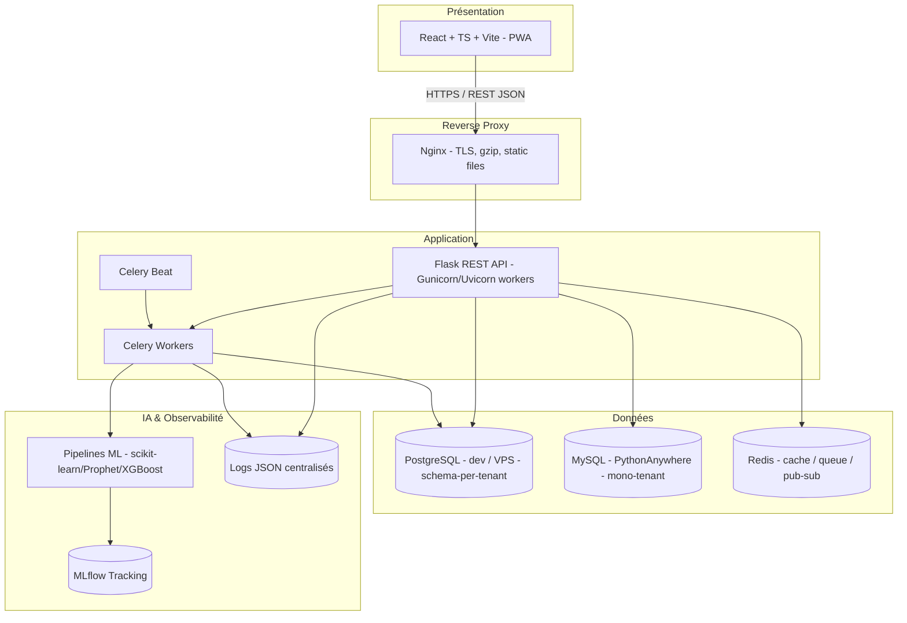
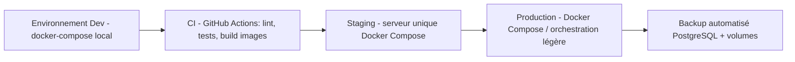
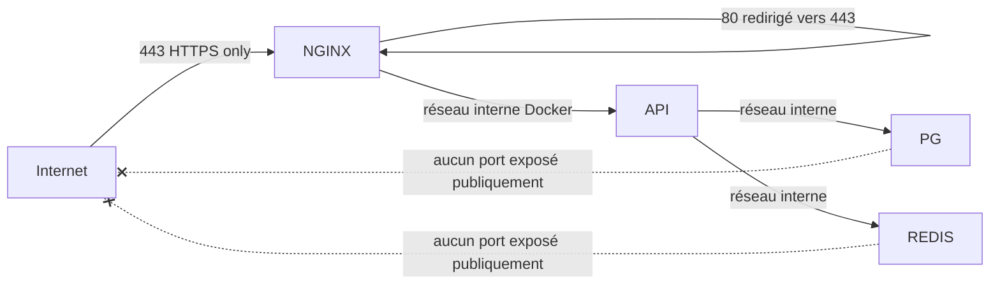
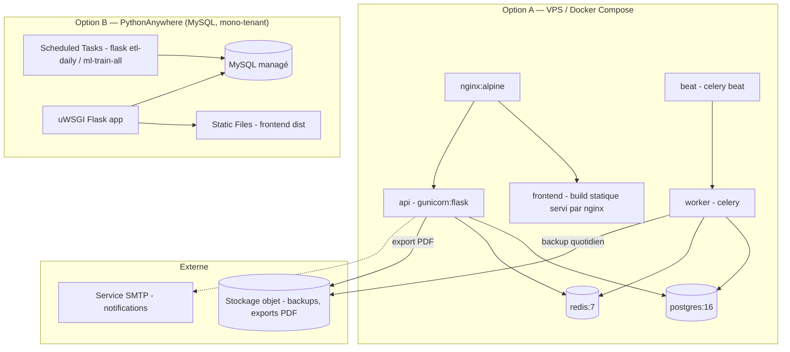

# 8. Architecture technique

## 8.1 Vue d'ensemble

GesCom-BF est une application **3-tiers**, déployée en conteneurs Docker, avec une architecture **API-first** (backend Flask exposant une API REST consommée par un frontend React découplé, lui-même packagé en PWA pour le mode hors-ligne).

## 8.2 Choix technologiques (rappel synthétique)

| Couche | Technologie | Rôle |
|---|---|---|
| Frontend | React 18 + TypeScript + Vite | SPA + PWA (offline-first) |
| Gestion d'état serveur | React Query (TanStack Query) | Cache, synchronisation, retry |
| Backend | Flask 3 + Blueprints | API REST modulaire |
| ORM / Migrations | SQLAlchemy 2 + Alembic | Persistance, versioning du schéma |
| Authentification | Flask-JWT-Extended | JWT access/refresh |
| Base de données (dev) | PostgreSQL 16 | Stockage relationnel, schema-per-tenant (multi-tenant V2) |
| Base de données (prod) | **MySQL 8.0** (PythonAnywhere) | Stockage relationnel, mono-tenant V1 — driver PyMySQL |
| Cache / Queue | Redis 7 | Cache API, file Celery, pub/sub WebSocket |
| Tâches asynchrones | Celery + Celery Beat (dev/VPS) · Scheduled Tasks (PythonAnywhere) | Entraînement ML, alertes, exports |
| IA | scikit-learn, Prophet, XGBoost | Prévision, scoring, anomalies |
| Suivi des modèles | MLflow | Registry, data lineage |
| Conteneurisation | Docker / Docker Compose | Reproductibilité dev |
| Reverse proxy | Nginx (VPS) · uWSGI (PythonAnywhere) | TLS, statique, load balancing |
| Serveur d'application | Gunicorn (VPS) · uWSGI (PythonAnywhere) | Exécution WSGI Flask |

## 8.3 Exigences non-fonctionnelles — traduction architecturale

| RNF | Traduction technique |
|---|---|
| RNF-01 (latence < 200 ms) | Index PostgreSQL ciblés (cf. `16-CONTRAINTES-SQL.md`), cache Redis sur les endpoints de lecture fréquente (catalogue, stock), pagination systématique |
| RNF-02 (disponibilité 99,5 %) | Health checks Docker, restart policy `unless-stopped`, réplication Nginx possible, monitoring (cf. `28-MONITORING-OBSERVABILITE.md`) |
| RNF-03/04/05/06 (volumétrie) | Index sur `(company_id, branch_id, product_id)`, partitionnement possible de `sales`/`stock_movements` par date au-delà de 500k lignes |
| RNF-07/08/09 (sécurité) | TLS via Nginx, bcrypt, JWT courts + refresh, cf. `18-SECURITE.md` |
| RNF-10 (offline) | PWA, Service Worker, IndexedDB, file de synchronisation — cf. `26-GESTION-OFFLINE-PWA.md` |
| RNF-11/12/13 (backup/PRA) | `pg_dump` (VPS) · export MySQL via `mysqldump` ou backup PythonAnywhere, cf. `25-DEPLOIEMENT-CICD.md` et `32-GUIDE-DEPLOIEMENT-PYTHONANYWHERE.md` |
| RNF-14 (couverture tests) | pytest + coverage.py (backend), Jest + Testing Library (frontend), seuil CI 80 % |
| RNF-15 (portabilité) | Images Docker multi-stage, `docker-compose.yml` pour environnements dev/staging/prod |
| RNF-16 (accessibilité) | i18next (fr/mooré), design responsive Tailwind |
| RNF-17 (lineage IA) | MLflow + table `predictions` référençant `model_version` |
| RNF-18 (rétention logs) | Politique de rétention PostgreSQL + archivage S3/MinIO à 1 an |

## 8.4 Architecture multi-environnements

## 8.5 Sécurité réseau (vue d'ensemble)

Détails complets dans `18-SECURITE.md`.

## 8.6 Stratégie offline-first (synthèse)

L'application web est packagée en **PWA** : manifest, Service Worker (Workbox), et **IndexedDB** comme cache de données (catalogue produits, stocks de la boutique, ventes en attente). Le Service Worker gère :

1. Le **cache des assets statiques** (app shell) pour un chargement instantané même hors-ligne.
2. Une **file de synchronisation** (Background Sync API) pour les ventes créées hors-ligne.
3. La **résolution de conflits** via l'API `/sync/sales` (cf. `26-GESTION-OFFLINE-PWA.md`).

## 8.7 Contraintes de volumétrie — dimensionnement

| Donnée | Volumétrie cible | Implication technique |
|---|---|---|
| Produits / tenant | 20 000 | Index sur `reference`, `category_id`; pagination |
| Ventes / jour / tenant | 2 000 | ~60 000/mois ; partitionnement par mois recommandé au-delà de 12 mois |
| Boutiques / tenant | 50 | Index `(company_id, branch_id)` sur `stock` |
| Tenants (an 1) | 200 | Schema-per-tenant : ~200 schémas PostgreSQL, gérés via Alembic multi-schéma |
| Logs d'audit | ~50k events/jour à pleine charge | Table append-only, partitionnement mensuel, archivage à 1 an |

## 8.8 Diagramme de déploiement (infrastructure cible)

