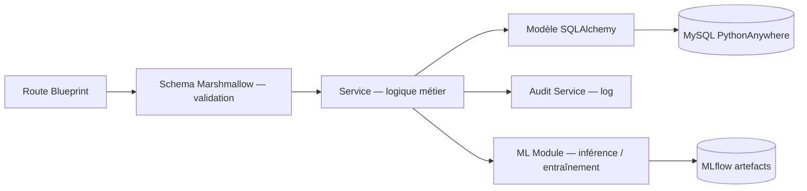

# 9. Backend Flask

> **Dernière mise à jour :** 24 juin 2026 — reflète l'état réel du code après corrections pré-soutenance.

## 9.1 Arborescence du projet

```text
backend/
├── app/
│   ├── __init__.py              # factory create_app()
│   ├── config.py                # configurations (Dev/Prod)
│   ├── extensions.py            # db, migrate, jwt, cors, ma, limiter
│   ├── celery_app.py
│   ├── cli.py
│   ├── seed.py / seed_demo.py
│   ├── blueprints/
│   │   ├── analytics/           # 20 endpoints ML/BI (threading)
│   │   ├── auth/                # /login (rate-limited), /register, /refresh, /logout
│   │   ├── inventory/
│   │   ├── products/
│   │   ├── reports/
│   │   ├── sales/
│   │   ├── stock/
│   │   ├── suppliers/
│   │   ├── transfers/
│   │   └── users/
│   ├── ml/
│   │   ├── common.py            # utilitaires ML partagés
│   │   ├── abc_xyz.py
│   │   ├── anomaly_detection.py
│   │   ├── credit_scoring.py    # + SHAP TreeExplainer
│   │   ├── demand_forecast.py   # + Prophet holidays BF
│   │   ├── market_basket.py     # Apriori + co-occurrence fallback
│   │   └── rfm_segmentation.py  # + Silhouette/Elbow + Churn proba
│   ├── models/
│   │   ├── audit.py
│   │   ├── auth.py
│   │   ├── base.py
│   │   ├── catalog.py
│   │   ├── company.py
│   │   ├── feature_store.py
│   │   ├── inventory.py
│   │   ├── ml.py
│   │   ├── sales.py             # Sale, SaleLine, Customer, CustomerPayment
│   │   ├── supplier.py
│   │   └── transfer.py
│   ├── services/
│   │   ├── analytics_service.py
│   │   ├── etl_service.py
│   │   ├── price_elasticity_service.py  # NEW
│   │   ├── reference_service.py
│   │   ├── sale_service.py
│   │   ├── stock_service.py
│   │   └── tenant_provisioning.py
│   ├── tasks/
│   │   ├── etl_tasks.py
│   │   └── ml_tasks.py          # TRAIN_FUNCTIONS : 6 modules
│   ├── middleware/
│   │   └── tenant.py
│   └── utils/
│       ├── dates.py
│       ├── db_dialect.py
│       ├── decorators.py
│       ├── errors.py
│       ├── pdf.py
│       ├── phonetic.py
│       └── tenant.py
├── migrations/
├── tests/
├── requirements.txt
├── wsgi.py
└── Dockerfile

# À la racine du dépôt (hors backend/) :
scripts/
└── cron_train_all.py    # Script cron PythonAnywhere — ETL + 6 modèles ML (cf. §9.5)
```

## 9.2 Extensions Flask (`app/extensions.py`)

Toutes les extensions sont initialisées dans `extensions.py` et liées à l'app dans `create_app()` via `ext.init_app(app)` :

```python
from flask_sqlalchemy import SQLAlchemy
from flask_migrate import Migrate
from flask_jwt_extended import JWTManager
from flask_cors import CORS
from flask_marshmallow import Marshmallow
from flask_limiter import Limiter

db      = SQLAlchemy()
migrate = Migrate()
jwt     = JWTManager()
cors    = CORS()
ma      = Marshmallow()

def _get_real_ip():
    """Priorité : CF-Connecting-IP → X-Forwarded-For → remote_addr."""
    from flask import request
    return (
        request.headers.get("CF-Connecting-IP")
        or request.headers.get("X-Forwarded-For", "").split(",")[0].strip()
        or request.remote_addr
    )

limiter = Limiter(
    key_func=_get_real_ip,
    default_limits=[],          # pas de limite globale — limites par route uniquement
    storage_uri="memory://",    # PythonAnywhere : pas de Redis
)
```

> `storage_uri="memory://"` : les compteurs sont en RAM. Compatibilité PythonAnywhere garantie. Les compteurs sont réinitialisés au redémarrage de l'app (acceptable pour ce contexte mono-tenant).

## 9.3 Organisation en Blueprints

| Blueprint | Préfixe | Routes principales | Responsabilité |
|---|---|---|---|
| `auth` | `/api/v1/auth` | `/login` *(10/min, 50/h)*, `/register` *(3/h)*, `/refresh`, `/logout`, `/change-password` | JWT + rate limiting |
| `users` | `/api/v1/users` | `/`, `/<id>`, `/roles`, `/audit-logs` | CRUD utilisateurs, rôles |
| `products` | `/api/v1` | `/products`, `/categories`, `/brands`, `/branches` | Catalogue produits |
| `suppliers` | `/api/v1` | `/suppliers`, `/receptions`, `/receptions/<id>/validate` | Fournisseurs, réceptions |
| `stock` | `/api/v1/stock` | `/`, `/<id>`, `/movements` | Stock par site |
| `transfers` | `/api/v1/transfers` | `/`, `/<id>`, `/<id>/send`, `/<id>/receive` | Transferts inter-sites |
| `inventory` | `/api/v1/inventory` | `/`, `/<id>`, `/lines`, `/<id>/validate` | Inventaires physiques |
| `sales` | `/api/v1/sales` | `/`, `/<id>`, `/sync`, `/customers`, `/credits`, `/refunds/...` | Ventes, avoirs, crédits |
| `reports` | `/api/v1/reports` | `/dashboard/summary`, `/dashboard/realtime`, `/stock/export` | Dashboards, exports |
| `analytics` | `/api/v1/analytics` | 20 endpoints — cf. §9.4 | BI + ML + IA |

## 9.4 Blueprint `analytics` — 20 endpoints

| Méthode | Route | Description |
|---|---|---|
| GET | `/dashboard` | KPIs étendu (marges, multi-site) |
| GET | `/kpis` | Indicateurs synthétiques |
| GET | `/sales-trend` | Série temporelle des ventes |
| GET | `/forecast` | Prévisions demande + alertes rupture |
| GET | `/credit-scores` | Scoring crédit clients |
| GET | `/credit-scores/<id>/explain` | **[NEW]** Explication SHAP du score crédit |
| GET | `/anomalies` | Anomalies détectées (IsolationForest) |
| GET | `/abc-xyz` | Classification ABC/XYZ produits |
| GET | `/rfm-segments` | Segmentation RFM clients |
| GET | `/rfm-segments/evaluate-k` | **[NEW]** Silhouette + Elbow — choix k optimal |
| GET | `/churn-risk` | **[NEW]** Probabilité de churn par client |
| GET | `/basket` | **[NEW]** Règles d'association (Market Basket) |
| POST | `/basket/train` | **[NEW]** Entraîner Market Basket (thread async) |
| GET | `/price-elasticity` | **[NEW]** Élasticité prix/remise |
| GET | `/african-context` | **[NEW]** Contexte africain BF (saisonnalité, stress trésorerie, crédit informel) |
| GET | `/cohorts` | Matrice de rétention par cohorte |
| GET | `/clv` | Customer Lifetime Value |
| GET | `/ml/models` | Registre des modèles entraînés |
| POST | `/ml/train` | Déclencher entraînement (body param) |
| POST | `/ml/train/<type>` | Déclencher entraînement (URL param) |

### Threading entraînement manuel

Les endpoints `POST /basket/train` et `POST /ml/train/<type>` lancent l'entraînement dans un **thread dédié** avec un contexte Flask propre :

```python
import threading

def _run_ml_task_async(task, model_type: str, app) -> None:
    """Thread body — push app_context pour accès DB."""
    with app.app_context():
        try:
            task.run()
        except Exception as e:
            current_app.logger.error(f"[ML-THREAD] {model_type}: {e}")

@analytics_bp.post("/ml/train/<model_type>")
@require_permission("ml:train")
def trigger_training(model_type):
    app_obj = current_app._get_current_object()
    task    = TRAIN_FUNCTIONS.get(model_type.upper())
    if task is None:
        return jsonify({"error": "Type inconnu"}), 400
    try:
        # Celery disponible (VPS) → asynchrone
        task.delay()
    except Exception:
        # PythonAnywhere : pas de broker → thread
        t = threading.Thread(
            target=_run_ml_task_async,
            args=(task, model_type, app_obj),
            daemon=True,
        )
        t.start()
    return jsonify({"status": "started", "model_type": model_type}), 202
```

## 9.5 Script cron PythonAnywhere (`scripts/cron_train_all.py`)

Situé à la **racine du dépôt** (`scripts/`, pas dans `backend/`), exécuté par les **Scheduled Tasks** PythonAnywhere (onglet Tasks, 02h00 UTC) :

```python
# scripts/cron_train_all.py (extrait)
import sys, os
sys.path.insert(0, os.path.join(os.path.dirname(__file__), "backend"))

from app import create_app
from app.tasks.etl_tasks import etl_build_features, etl_extract_and_clean, etl_validate
from app.tasks.ml_tasks import (
    compute_demand_forecast_task, compute_rfm_segmentation_task,
    compute_anomaly_detection_task, compute_credit_scoring_task,
    compute_abc_xyz_task, compute_market_basket_task,
)

flask_app = create_app("production")
with flask_app.app_context():
    # ETL d'abord, puis 6 modèles — chaque erreur est attrapée indépendamment
    for task_fn in [
        etl_extract_and_clean, etl_validate, etl_build_features,
        compute_demand_forecast_task, compute_credit_scoring_task,
        compute_anomaly_detection_task, compute_rfm_segmentation_task,
        compute_abc_xyz_task, compute_market_basket_task,
    ]:
        try:
            task_fn.run()
        except Exception as exc:
            print(f"[ERROR] {task_fn.__name__}: {exc}")
```

Commande PythonAnywhere :
```
/home/<username>/.virtualenvs/gescom-bf/bin/python \
    /home/<username>/gescom-bf/scripts/cron_train_all.py
```
Logs : `logs/cron_train_all.log` ; exit code 1 si une tâche échoue.

## 9.6 Pattern d'implémentation (couches)



## 9.7 Gestion multi-tenant / mono-tenant

| Dialecte | Mode | Comportement |
|---|---|---|
| PostgreSQL (dev / VPS) | Multi-tenant | `SET search_path TO tenant_<slug>, public` |
| MySQL (PythonAnywhere) | **Mono-tenant** | `set_search_path` est un no-op — toutes les tables dans `<user>$gescom_bf` |

## 9.8 Gestion centralisée des erreurs

| Code HTTP | Code applicatif | Cas d'usage |
|---|---|---|
| 400 | `VALIDATION_ERROR` | Données invalides (Marshmallow) |
| 401 | `INVALID_CREDENTIALS` / `TOKEN_EXPIRED` | Authentification |
| 403 | `FORBIDDEN` / `ACCOUNT_DISABLED` / `PASSWORD_CHANGE_REQUIRED` | RBAC, compte désactivé, RF-05 (must_change_password=True) |
| 404 | `NOT_FOUND` | Ressource inexistante |
| 409 | `INSUFFICIENT_STOCK` / `CONFLICT` | Conflits métier |
| 422 | `DISCOUNT_APPROVAL_REQUIRED` | Règle de gestion non respectée |
| 429 | `RATE_LIMIT_EXCEEDED` | Flask-Limiter — trop de tentatives |
| 500 | `INTERNAL_ERROR` | Erreur serveur (loggée, message générique client) |

## 9.9 Configuration par environnement

```python
class BaseConfig:
    SQLALCHEMY_TRACK_MODIFICATIONS = False
    JWT_ACCESS_TOKEN_EXPIRES  = timedelta(minutes=15)
    JWT_REFRESH_TOKEN_EXPIRES = timedelta(days=7)
    # Pas de CELERY_BROKER_URL — Celery non utilisé sur PythonAnywhere
    # L'entraînement ML asynchrone passe par des threads Python natifs

class ProdConfig(BaseConfig):
    DEBUG = False
    PROPAGATE_EXCEPTIONS = True
    # Flask-Limiter : storage_uri=memory:// défini dans extensions.py
    # (pas de RATELIMIT_STORAGE_URI dans config — intentionnel)
    SENTRY_DSN = os.environ.get("SENTRY_DSN")  # optionnel — monitoring Sentry
```

## 9.10 Dépendances principales (`requirements.txt`)

```txt
Flask==3.0.3
Flask-SQLAlchemy==3.1.1
Flask-Migrate==4.0.7
Flask-JWT-Extended==4.6.0
Flask-Cors==4.0.1
Flask-Limiter==3.8.0          # rate limiting — NEW
flask-marshmallow==1.2.1
marshmallow==3.21.3
PyMySQL==1.1.1
psycopg2-binary==2.9.9
python-dotenv==1.0.1
bcrypt==4.1.3
gunicorn==22.0.0

# ML
pandas==2.2.2
numpy==1.26.4
scikit-learn==1.5.1
xgboost==2.1.1
prophet==1.1.5
joblib==1.4.2
shap==0.45.1                  # explicabilité SHAP — NEW
mlxtend==0.23.1               # Apriori Market Basket — NEW
mlflow==2.14.3

# Documents
reportlab==4.2.2
openpyxl==3.1.5

# Monitoring (optionnel)
sentry-sdk[flask]==2.x          # activé uniquement si SENTRY_DSN défini

# Celery supprimé — entraînements ML via threads natifs + cron PythonAnywhere
redis==5.0.7
```

## 9.11 Corrections de stabilité (dev Docker Compose)

### Werkzeug reloader désactivé (`--no-reload`)

En développement Docker/WSL2, le rechargeur Werkzeug peut invalider les tokens JWT. Correction dans `docker-compose.yml` :

```yaml
command: >
  sh -c "flask db upgrade && python -m app.seed &&
         flask run --host=0.0.0.0 --port=5000 --no-reload"
```

### Clé JWT (longueur minimale)

```env
# python3 -c "import secrets; print(secrets.token_hex(32))"
JWT_SECRET_KEY=<64 caractères hex — 256 bits>
```

### Celery : avertissement de reconnexion

```python
celery_app.conf.update(broker_connection_retry_on_startup=True)
```
