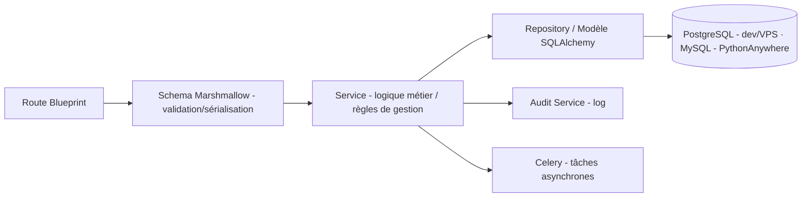

# 9. Backend Flask

## 9.1 Arborescence du projet

```text
backend/
├── app/
│   ├── __init__.py            # factory create_app()
│   ├── config.py              # configurations (dev/staging/prod)
│   ├── extensions.py          # init SQLAlchemy, JWT, Celery, Redis
│   ├── middleware/
│   │   ├── tenant.py          # résolution du tenant depuis le JWT -> set search_path
│   │   └── error_handlers.py  # gestion centralisée des erreurs
│   ├── auth/
│   │   ├── routes.py
│   │   ├── schemas.py          # Marshmallow
│   │   └── services.py
│   ├── users/
│   ├── products/
│   ├── suppliers/
│   ├── inventory/              # dépôt + transferts + inventaires physiques
│   ├── sales/
│   ├── reports/
│   ├── analytics/
│   ├── ai/                     # endpoints prévisions, scoring, anomalies
│   ├── audit/
│   ├── sync/                   # synchronisation offline
│   └── models/
│       ├── company.py
│       ├── user.py
│       ├── product.py
│       ├── stock.py
│       ├── sale.py
│       ├── transfer.py
│       ├── inventory.py
│       ├── audit.py
│       └── prediction.py
├── migrations/                 # Alembic (multi-schéma)
├── tasks/                       # tâches Celery
│   ├── ml_tasks.py
│   ├── alert_tasks.py
│   └── sync_tasks.py
├── tests/
│   ├── unit/
│   └── integration/
├── ml/
│   ├── pipelines/
│   ├── models/
│   └── training/
├── wsgi.py
├── requirements.txt
└── Dockerfile
```

## 9.2 Organisation en Blueprints

| Blueprint | Préfixe d'enregistrement | Routes exposées | Responsabilité |
|---|---|---|---|
| `auth` | `/api/v1/auth` | `/login`, `/refresh`, `/logout`, `/change-password` | Authentification JWT |
| `users` | `/api/v1/users` | `/`, `/<id>`, `/roles`, `/audit-logs` | CRUD utilisateurs, rôles, journal d'audit |
| `products` | `/api/v1` | `/products`, `/categories`, `/brands`, `/branches` | Catalogue produits, sites |
| `suppliers` | `/api/v1` | `/suppliers`, `/receptions`, `/receptions/<id>/validate` | Fournisseurs, réceptions de marchandises |
| `stock` | `/api/v1/stock` | `/`, `/<id>`, `/movements` | Consultation du stock par site |
| `transfers` | `/api/v1/transfers` | `/`, `/<id>`, `/<id>/send`, `/<id>/receive` | Transferts inter-sites |
| `inventory` | `/api/v1/inventory` | `/`, `/<id>`, `/<id>/lines`, `/<id>/validate` | Inventaires physiques |
| `sales` | `/api/v1/sales` | `/`, `/<id>`, `/sync`, `/customers`, `/refunds/pending`, `/<id>/refund`, `/<id>/refund/approve`, `/<id>/refund/reject`, `/credits`, `/customers/<id>/settle` | Ventes, avoirs, clients, encours crédit |
| `reports` | `/api/v1/reports` | `/dashboard/summary`, `/dashboard/realtime`, `/dashboard/stream`, `/stock/export` | Tableaux de bord, exports |
| `analytics` | `/api/v1/analytics` | `/kpis`, `/abc-xyz`, `/ml/models`, `/ml/train`, `/ml/train/<type>` | KPIs, classification, entraînement ML |

> **Note d'implémentation** : `products_bp` et `suppliers_bp` sont enregistrés avec le préfixe `/api/v1` (sans suffixe de module) car leurs routes déclarent elles-mêmes `/products`, `/suppliers`, `/receptions`, etc. Ceci permet à ces blueprints de partager le même préfixe d'API racine sans collision.

> **Journal d'audit** : exposé via `GET /api/v1/users/audit-logs` (blueprint `users`), pas sous `/audit`. Filtres : `event_type`, `user_id`, `page`, `per_page`.

## 9.3 Pattern d'implémentation (couches)



Chaque module suit la structure **routes → schemas → services → models**, garantissant la séparation des responsabilités et la testabilité (les services sont testés unitairement sans dépendance HTTP).

## 9.4 Gestion multi-tenant / mono-tenant (résolution du schéma)

Le middleware détecte le dialecte de la base de données et adapte son comportement :

```python
# app/utils/tenant.py (extrait)
from app.utils.db_dialect import is_postgres_engine

def set_search_path(schema_name: str) -> None:
    """PostgreSQL : exécute SET search_path. MySQL : no-op (mono-tenant)."""
    if not is_postgres_engine(db.session.get_bind()):
        return   # MySQL / PythonAnywhere — toutes les tables sont dans la même base
    if schema_name == "public":
        db.session.execute(text("SET search_path TO public"))
    else:
        db.session.execute(text(f'SET search_path TO "{schema_name}", public'))
```

| Dialecte | Mode | Comportement |
|---|---|---|
| PostgreSQL (dev / VPS) | Multi-tenant | `SET search_path TO tenant_<slug>, public` par requête |
| MySQL (PythonAnywhere) | **Mono-tenant** | `set_search_path` est un no-op ; toutes les tables dans la base `<user>$gescom_bf` |

> Cf. `app/utils/db_dialect.py` pour la détection du dialecte. Cf. `27-MODELE-SAAS-MULTITENANT.md` pour le détail multi-tenant PostgreSQL.

## 9.5 Exemple de service métier (vente avec remise)

```python
# app/sales/services.py (extrait illustratif)
class SaleService:

    ALLOWED_DISCOUNTS = {0, 5, 10, 15, 20}

    def create_sale(self, payload, current_user):
        if payload.get("discount_rate", 0) not in self.ALLOWED_DISCOUNTS:
            raise ValidationError("DISCOUNT_RATE_INVALID")

        if payload.get("discount_rate", 0) > 0 and not payload.get("approved_by_user_id"):
            raise ValidationError("DISCOUNT_APPROVAL_REQUIRED")

        for line in payload["lines"]:
            available = StockRepository.get_available(
                product_id=line["product_id"], branch_id=current_user.branch_id
            )
            if available < line["quantity"] and payload["channel"] != "offline":
                raise ConflictError("INSUFFICIENT_STOCK")

        sale = SaleRepository.create(payload, seller_id=current_user.id)
        StockRepository.decrement_many(payload["lines"], current_user.branch_id)
        AuditService.log("SALE_CREATED", entity="sale", entity_id=sale.id, user=current_user)
        if payload.get("discount_rate", 0) > 0:
            AuditService.log(
                "DISCOUNT_APPLIED", entity="sale", entity_id=sale.id,
                user=current_user, after={"rate": payload["discount_rate"],
                                           "approved_by": payload["approved_by_user_id"]}
            )
        return sale
```

## 9.6 Gestion centralisée des erreurs

| Code HTTP | Code applicatif | Cas d'usage |
|---|---|---|
| 400 | `VALIDATION_ERROR` | Données d'entrée invalides (Marshmallow) |
| 401 | `INVALID_CREDENTIALS` / `TOKEN_EXPIRED` | Authentification |
| 403 | `FORBIDDEN` / `ACCOUNT_DISABLED` | RBAC, compte désactivé |
| 404 | `NOT_FOUND` | Ressource inexistante |
| 409 | `INSUFFICIENT_STOCK` / `CONFLICT` | Conflits métier |
| 422 | `DISCOUNT_APPROVAL_REQUIRED` | Règle de gestion non respectée |
| 500 | `INTERNAL_ERROR` | Erreur serveur (loggée, message générique côté client) |

## 9.7 Tâches planifiées (Celery Beat sur VPS · Scheduled Tasks sur PythonAnywhere)

| Tâche | Commande CLI Flask | Fréquence | Description |
|---|---|---|---|
| `recompute_stock_predictions` | `flask ml-train-all` | Quotidienne (02h00) | Réentraîne/actualise les prévisions Prophet/XGBoost par produit/site (RG-37) |
| `recompute_credit_scores` | — (déclenché par signal) | À chaque vente à crédit + nuit | Met à jour le score de solvabilité (RG-39) |
| `run_anomaly_detection` | `flask anomaly-detect` | Toutes les heures | Exécute Isolation Forest sur les transactions récentes |
| `compute_abc_xyz` | `flask abc-xyz` | Hebdomadaire | Recalcule la classification ABC/XYZ |
| `db_backup` | `flask db-backup` | Quotidienne (03h00) | `pg_dump` (VPS) ou export MySQL (PythonAnywhere) |
| `purge_old_audit_logs` | `flask purge-audit-logs` | Mensuelle | Archive les logs > 1 an vers stockage froid |
| ETL Feature Store | `flask etl-daily` | Quotidienne | Extraction, validation, feature engineering |

> Sur **PythonAnywhere**, ces commandes sont exécutées via les **Scheduled Tasks** (onglet "Tasks") — Celery et Redis ne sont pas requis. Sur VPS, Celery Beat les déclenche selon la config `CELERY_BEAT_SCHEDULE`.

## 9.8 Configuration par environnement

```python
# app/config.py (extrait)
class BaseConfig:
    SQLALCHEMY_TRACK_MODIFICATIONS = False
    # JWT : durée de vie des tokens (lus depuis .env)
    JWT_ACCESS_TOKEN_EXPIRES = timedelta(
        minutes=int(os.environ.get("JWT_ACCESS_TOKEN_EXPIRES_MINUTES", 60))
    )
    JWT_REFRESH_TOKEN_EXPIRES = timedelta(
        days=int(os.environ.get("JWT_REFRESH_TOKEN_EXPIRES_DAYS", 7))
    )
    CELERY_BROKER_URL = os.environ.get("CELERY_BROKER_URL", "redis://localhost:6379/0")

class DevConfig(BaseConfig):
    DEBUG = True   # N'active PAS le rechargeur Werkzeug (voir §9.9)

class ProdConfig(BaseConfig):
    DEBUG = False
    PROPAGATE_EXCEPTIONS = True
```

## 9.9 Corrections de stabilité (dev Docker Compose)

### 9.9.1 Werkzeug reloader désactivé (`--no-reload`)

En développement Docker/WSL2, le rechargeur de fichiers Werkzeug (`DEBUG=True`) surveille les fichiers montés via volume (`./backend:/app`). Sur WSL2, les événements `inotify` peuvent être déclenchés par des opérations normales du système de fichiers et provoquer des redémarrages de Flask en cours de session — invalidant les tokens JWT en mémoire et forçant une reconnexion toutes les ~72 secondes.

**Correction appliquée dans `docker-compose.yml`** :

```yaml
command: >
  sh -c "flask db upgrade && python -m app.seed &&
         flask run --host=0.0.0.0 --port=5000 --no-reload"
```

> `--no-reload` désactive le rechargeur de fichiers. Pour appliquer une modification de code, relancer manuellement le conteneur `api` (`docker compose restart api`).

### 9.9.2 Clé secrète JWT (longueur minimale HMAC)

Flask-JWT-Extended émet un `InsecureKeyLengthWarning` si `JWT_SECRET_KEY` fait moins de 32 octets. La valeur par défaut `"dev-jwt-secret"` (15 octets) déclenchait cet avertissement.

**Variable `.env` correcte** :

```env
# Générer : python3 -c "import secrets; print(secrets.token_hex(32))"
# (produit 64 caractères hex = 256 bits — minimum recommandé : 32 octets)
JWT_SECRET_KEY=<64 caractères hex>
JWT_ACCESS_TOKEN_EXPIRES_MINUTES=60
```

> En production PythonAnywhere, utiliser `secrets.token_hex(32)` (128 bits minimum, 256 bits recommandé). Ne jamais committer la vraie clé dans le dépôt.

### 9.9.3 Celery : avertissement de connexion au démarrage

Depuis Celery 5.3, la tentative de reconnexion au broker au démarrage sans configuration explicite génère un `CPendingDeprecationWarning`.

**Correction appliquée dans `backend/app/celery_app.py`** :

```python
celery_app.conf.update(
    broker_connection_retry_on_startup=True,   # supprime le warning Celery 5.3+
    # ... autres clés de configuration
)
```
