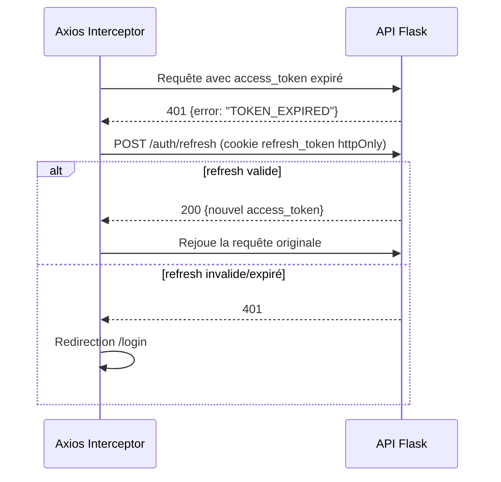
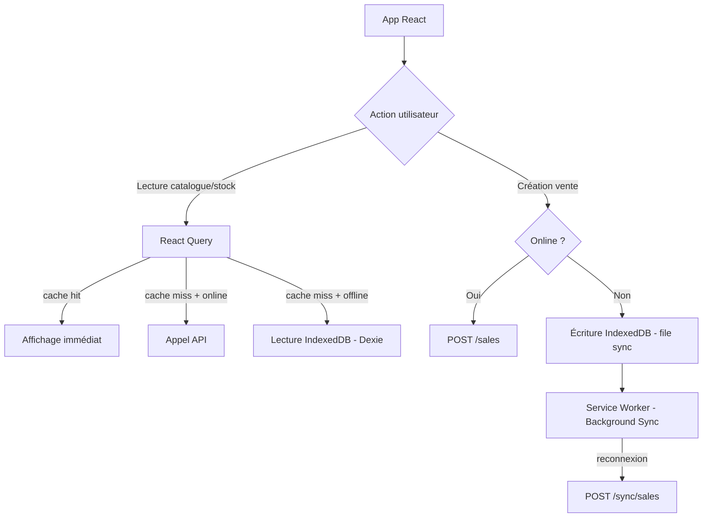

# 10. Frontend React (PWA)

> **Dernière mise à jour :** 1er juillet 2026 — mise à jour conformité code v2.

## 10.1 Arborescence du projet

```text
frontend/
├── public/
│   ├── manifest.json           # configuration PWA
│   └── icons/
├── src/
│   ├── app/
│   │   ├── router.tsx
│   │   └── store.ts             # état global léger (Zustand)
│   ├── api/
│   │   ├── client.ts            # axios + intercepteur refresh JWT
│   │   └── endpoints/
│   ├── features/
│   │   ├── auth/
│   │   ├── products/
│   │   ├── stock/
│   │   ├── transfers/
│   │   ├── sales/                # écran caissier
│   │   ├── inventory/
│   │   ├── reports/
│   │   ├── dashboard/
│   │   └── ai/
│   ├── offline/
│   │   ├── db.ts                 # IndexedDB (Dexie.js)
│   │   ├── syncQueue.ts
│   │   └── serviceWorker.ts
│   ├── i18n/
│   │   ├── fr.json
│   │   └── mos.json               # mooré
│   ├── components/                # composants UI réutilisables
│   ├── hooks/
│   └── main.tsx
├── tests/
│   ├── unit/
│   └── e2e/
├── vite.config.ts
├── package.json
└── Dockerfile
```

## 10.2 Stack technique détaillée

| Élément | Outil | Justification |
|---|---|---|
| Build | Vite | Démarrage rapide, HMR, build optimisé PWA |
| Langage | TypeScript | Typage fort, réduction des bugs runtime |
| Routing | React Router v6 | Standard, lazy loading par route |
| Données serveur | TanStack Query (React Query) | Cache, retries, synchronisation background |
| État global léger | Zustand | Session utilisateur, préférences UI |
| Formulaires | React Hook Form + Zod | Validation cohérente avec les schémas backend |
| Style | Tailwind CSS | Responsive rapide, cohérence design |
| PWA | Vite PWA Plugin (Workbox) | Service Worker, manifest, cache stratégies |
| Stockage local | Dexie.js (wrapper IndexedDB) | File de synchronisation, cache catalogue/stock |
| i18n | react-i18next | Français / Mooré |
| Graphiques | Recharts / D3.js | Dashboard, ABC/XYZ |
| Tests | Jest + React Testing Library + Playwright (E2E) | Unitaires + bout-en-bout |

## 10.3 Écrans principaux

| Écran | Route | Description | Accès |
|---|---|---|---|
| Connexion | `/login` | Authentification | Tous |
| Tableau de bord | `/dashboard` | KPIs, alertes IA, graphiques | Administrateur |
| Catalogue produits | `/products` | CRUD produits, catégories, marques | Admin, Magasinier |
| Stock dépôt | `/depot/stock` | Vue stock dépôt central | Magasinier, Admin |
| Stock boutique | `/boutique/stock` | Vue stock boutique courante | Vendeur, Admin |
| Transferts | `/transfers` | Création/réception de transferts | Magasinier, Admin |
| **Caisse (vente)** | `/sales/pos` | Écran caissier optimisé (raccourcis, offline) | Vendeur |
| Inventaire | `/inventory` | Saisie comptage, écarts | Magasinier, Vendeur |
| Rapports | `/reports` | Rapports consolidés, export PDF | Admin |
| Analytics | `/analytics` | ABC/XYZ, segmentation clients | Admin |
| Module IA | `/ai/predictions`, `/ai/credit-scoring`, `/ai/anomalies` | Prévisions, scoring, anomalies | Admin |
| Audit | `/audit` | Journaux | Admin |

Maquettes détaillées (wireframes) dans `29-WIREFRAMES-UI.md`.

## 10.4 Écran caissier — particularités UX

- **Mode caissier ultra-rapide** : navigation 100 % clavier (raccourcis `F1`-`F8` pour produits favoris, `Entrée` pour valider une ligne, `F12` pour finaliser la vente).
- **Recherche produit phonétique** (tolérance aux fautes de frappe) : implémentée via une recherche floue côté client sur le cache IndexedDB du catalogue (algorithme de distance de Levenshtein / Fuse.js), garantissant le fonctionnement **hors-ligne**.
- **Bandeau d'état de connexion** : indicateur visuel (en ligne / hors-ligne / synchronisation en cours) toujours visible.
- **Sélecteur de remise** : boutons radio limités à {0, 5, 10, 15, 20 %} ; sélection obligatoire de l'administrateur approbateur si remise > 0 (modale de confirmation).
- **Support mooré** : bascule de langue pour les libellés produits, utile pour les vendeurs peu à l'aise en français écrit.

## 10.5 Gestion du token JWT côté client



## 10.6 Architecture PWA / offline (vue frontend)



Détails complets dans `26-GESTION-OFFLINE-PWA.md`.

> **Note SSE / PythonAnywhere :** les Server-Sent Events (SSE) sont **désactivés en production** (`DISABLE_SSE=true` côté serveur PythonAnywhere). Le frontend bascule automatiquement sur un mécanisme de **polling périodique** (React Query `refetchInterval`) pour les mises à jour en quasi-temps réel (stock, alertes). Les SSE restent disponibles en développement local.

## 10.7 Internationalisation (i18n)

```json
// src/i18n/fr.json (extrait)
{
  "sales.discount.label": "Remise",
  "sales.discount.approval_required": "Sélectionnez l'administrateur ayant donné son accord"
}
```

```json
// src/i18n/mos.json (extrait - libellés produits uniquement, mooré)
{
  "product.category.fer": "Kut-bila",
  "product.category.peinture": "Mensé"
}
```

> Remarque : la couverture complète du mooré (langue à transmission majoritairement orale) se concentre sur les **libellés produits et catégories** les plus utilisés, établis avec des utilisateurs pilotes — cf. `29-WIREFRAMES-UI.md` pour le processus de collecte terminologique.
