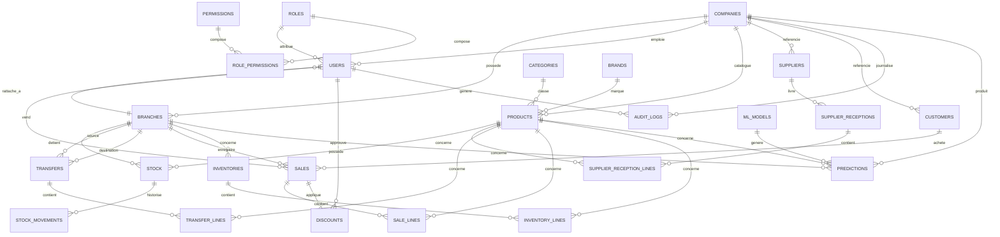

# 11. Base de données — Vue d'ensemble

> **Dernière mise à jour :** 1er juillet 2026 — mise à jour conformité code v2.

## 11.1 Approche de modélisation

La base de données est modélisée en trois niveaux successifs, conformément à la méthodologie de génie logiciel attendue :

1. **MCD (Modèle Conceptuel de Données)** — `12-MCD.md` : entités métier et associations, indépendant de toute technologie.
2. **MLD (Modèle Logique de Données)** — `13-MLD.md` : traduction relationnelle (tables, clés primaires/étrangères, cardinalités résolues).
3. **MPD (Modèle Physique de Données)** — `14-MPD.md` : DDL de référence (types, contraintes, index). Le DDL est généré par Alembic et adapté automatiquement au dialecte : **PostgreSQL 16** (dev / VPS) ou **MySQL 8.0** (production PythonAnywhere, driver PyMySQL).

> **Dialecte actif** : détecté automatiquement depuis `DATABASE_URL` via `backend/app/utils/db_dialect.py`. Aucune modification de code n'est nécessaire pour basculer d'un dialecte à l'autre.

Le **dictionnaire des données** (`15-DICTIONNAIRE-DES-DONNEES.md`) documente chaque attribut, et `16-CONTRAINTES-SQL.md` détaille les contraintes, triggers et index avancés.

## 11.2 Périmètre des données (synthèse des tables)

| Domaine | Tables |
|---|---|
| Organisation / Multi-tenant | `companies`, `branches` |
| Sécurité & Utilisateurs | `users`, `roles`, `permissions`, `role_permissions`, `token_blocklist` |
| Référentiels | `categories`, `brands`, `products`, `suppliers`, `customers` |
| Stock & Mouvements | `stock`, `stock_movements` |
| Approvisionnement | `supplier_receptions`, `supplier_reception_lines` |
| Transferts | `transfers`, `transfer_lines` |
| Ventes | `sales`, `sale_lines`, `discounts` |
| Inventaires | `inventories`, `inventory_lines` |
| Audit | `audit_logs` |
| Intelligence Artificielle | `predictions`, `ml_models` |

## 11.3 Schéma relationnel global (vue simplifiée)

## 11.4 Volumétrie estimée (par tenant, cf. RNF-03 à RNF-06)

| Table | Volumétrie estimée (1 an, tenant moyen) | Croissance |
|---|---|---|
| `products` | 2 000 – 20 000 | Faible |
| `stock` | produits × sites (≈ 20 000 × 6 = 120 000) | Faible |
| `stock_movements` | ~500 000 | Élevée (partitionnement mensuel recommandé) |
| `sales` | ~500 000 (2 000/jour × 250 jours) | Élevée |
| `sale_lines` | ~1 500 000 (×3 lignes/vente moyen) | Élevée |
| `audit_logs` | ~1 000 000 | Élevée (rétention 1 an, archivage) |
| `predictions` | ~20 000/jour (1 par produit/site actif) | Élevée (purge > 90 jours) |

## 11.5 Stratégie de déploiement — mono-tenant (MySQL) vs multi-tenant (PostgreSQL)

| Mode | Base de données | Isolation | Disponibilité |
|---|---|---|---|
| **Mono-tenant V1** (PythonAnywhere) | MySQL 8.0 | Toutes les tables dans `<user>$gescom_bf` | ✅ Production immédiate |
| **Multi-tenant V2** (VPS / PostgreSQL) | PostgreSQL 16 | Schéma dédié par tenant (`tenant_<slug>`) | 🔜 Migration VPS |

**Mode mono-tenant (MySQL — actif en production PythonAnywhere) :**
- Toutes les tables des 32 migrations coexistent dans la même base MySQL.
- `SET search_path` est désactivé (no-op dans `app/utils/tenant.py`).
- `CREATE SCHEMA` est omis dans les migrations (détection automatique du dialecte).
- `POST /api/v1/companies/register` retourne `503 MULTI_TENANT_UNAVAILABLE` (cf. `app/services/tenant_provisioning.py`).

**Mode multi-tenant (PostgreSQL — dev Docker et futur VPS) :**
- Chaque entreprise cliente dispose de son propre **schéma PostgreSQL** (`tenant_<slug>`).
- Le schéma `public` contient les tables transverses : `companies` et `user_index`.
- `SET search_path TO tenant_<slug>, public` est exécuté à chaque requête par le middleware.
- Voir `27-MODELE-SAAS-MULTITENANT.md` pour le détail des migrations multi-schéma.

## 11.6 Champs et tables ajoutés en v2 (migrations Alembic — 10 migrations dans `backend/migrations/versions/`)

### Champ `users.must_change_password`

| Colonne | Type | Défaut | Rôle |
|---|---|---|---|
| `must_change_password` | `BOOLEAN` | `TRUE` | RF-05 : si `TRUE`, le JWT contient le claim `must_change_password=true` et toutes les routes protégées retournent `403 PASSWORD_CHANGE_REQUIRED` jusqu'à ce que l'utilisateur change son mot de passe. |

### Champ `sales.approved_by_id`

| Colonne | Type | Nullable | Rôle |
|---|---|---|---|
| `approved_by_id` | `VARCHAR(36)` (FK → `users.id`) | Oui | RF-16/RG-23 : obligatoire (non-nullable applicatif) lorsque `discount_rate > 0`. Si absent avec remise, l'API retourne `422 VALIDATION_ERROR`. |

### Table `token_blocklist`

Stockage SQL des tokens JWT révoqués (remplace tout mécanisme Redis pour la révocation) :

| Colonne | Type | Description |
|---|---|---|
| `id` | `INTEGER` (PK, auto-increment) | Identifiant interne |
| `jti` | `VARCHAR` (UNIQUE, NOT NULL) | JWT ID unique du token révoqué |
| `user_id` | `VARCHAR(36)` (FK → `users.id`) | Propriétaire du token |
| `created_at` | `DATETIME` | Date de révocation |
| `expires_at` | `DATETIME` | Date d'expiration naturelle (permet la purge des entrées obsolètes) |

> À chaque requête authentifiée, le backend vérifie que le `jti` du token n'est pas présent dans `token_blocklist`. Pas de Redis requis : la table SQL est suffisante pour le volume cible.
