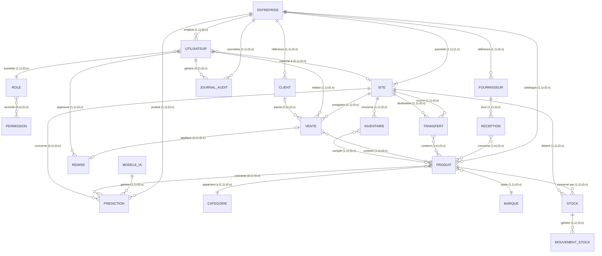

# 12. Modèle Conceptuel de Données (MCD — méthode Merise)

## 12.1 Liste des entités et propriétés conceptuelles

| Entité | Identifiant | Propriétés principales |
|---|---|---|
| **ENTREPRISE** | id_entreprise | nom, plan_abonnement, date_creation |
| **SITE** (dépôt ou boutique) | id_site | nom, type_site (DEPOT_CENTRAL / BOUTIQUE), adresse |
| **UTILISATEUR** | id_utilisateur | nom, email, mot_de_passe_hash, est_actif, derniere_connexion |
| **ROLE** | id_role | nom_role, description |
| **PERMISSION** | id_permission | code_permission, description |
| **CATEGORIE** | id_categorie | nom_categorie |
| **MARQUE** | id_marque | nom_marque |
| **PRODUIT** | id_produit | nom, nom_moore, reference, prix_achat, prix_client_simple, prix_technicien, est_actif |
| **STOCK** | id_stock | quantite, seuil_min, date_maj |
| **MOUVEMENT_STOCK** | id_mouvement | type_mouvement, quantite, date_mouvement |
| **FOURNISSEUR** | id_fournisseur | nom, telephone, adresse |
| **RECEPTION** | id_reception | date_reception, reference_bon |
| **CLIENT** | id_client | nom, telephone, type_client, solde_du, score_credit |
| **TRANSFERT** | id_transfert | statut, date_creation, date_reception |
| **VENTE** | id_vente | statut, canal, uuid_offline, montant_total, date_vente |
| **REMISE** | id_remise | taux, note_approbation |
| **INVENTAIRE** | id_inventaire | statut, date_creation, date_validation |
| **JOURNAL_AUDIT** | id_log | type_evenement, entite, donnees_avant, donnees_apres, date_evenement |
| **MODELE_IA** | id_modele | type_modele, version, date_entrainement, metriques |
| **PREDICTION** | id_prediction | type_prediction, contenu, date_generation |

## 12.2 Diagramme entité-association (notation Merise simplifiée)

## 12.3 Description des associations porteuses de données

| Association | Entités liées | Propriétés portées par l'association | Cardinalités |
|---|---|---|---|
| **CONTIENT** (Vente-Produit) | VENTE, PRODUIT | quantite, prix_unitaire_applique, type_prix (simple/technicien) | (1,n) - (0,n) → résolue en entité **LIGNE_VENTE** |
| **CONTIENT** (Transfert-Produit) | TRANSFERT, PRODUIT | quantite | (1,n) - (0,n) → résolue en entité **LIGNE_TRANSFERT** |
| **COMPTE** (Inventaire-Produit) | INVENTAIRE, PRODUIT | quantite_theorique, quantite_comptee, justification | (1,n) - (0,n) → résolue en entité **LIGNE_INVENTAIRE** |
| **CONCERNE** (Réception-Produit) | RECEPTION, PRODUIT | quantite_recue, prix_achat_unitaire | (1,n) - (0,n) → résolue en entité **LIGNE_RECEPTION** |
| **ACCORDE** (Rôle-Permission) | ROLE, PERMISSION | - | (0,n) - (0,n) → résolue en entité **ROLE_PERMISSION** |

> Conformément à la méthode Merise, les associations porteuses de données et les associations N:N sont **résolues en entités intermédiaires** lors du passage au MLD (cf. `13-MLD.md`) : `LIGNE_VENTE`, `LIGNE_TRANSFERT`, `LIGNE_INVENTAIRE`, `LIGNE_RECEPTION`, `ROLE_PERMISSION`.

## 12.4 Règles de gestion traduites en cardinalités

| Règle de gestion (cf. `04-REGLES-METIER.md`) | Traduction MCD |
|---|---|
| RG-01 : une entreprise a un seul dépôt central et N boutiques | Association ENTREPRISE-SITE avec attribut discriminant `type_site`, contrainte d'unicité applicative sur `type_site=DEPOT_CENTRAL` |
| RG-04/RG-05 : un utilisateur est rattaché à 0 ou 1 site | Cardinalité (0,1) côté SITE pour UTILISATEUR |
| RG-13 : le stock est toujours rattaché à un site | Cardinalité (1,1) entre STOCK et SITE |
| RG-23 : une remise référence l'administrateur approbateur | Association REMISE-UTILISATEUR (1,1) |
| RG-26 : une vente à crédit référence un client | Cardinalité (0,1) entre VENTE et CLIENT (0 si vente comptant anonyme) |
| RG-40 :