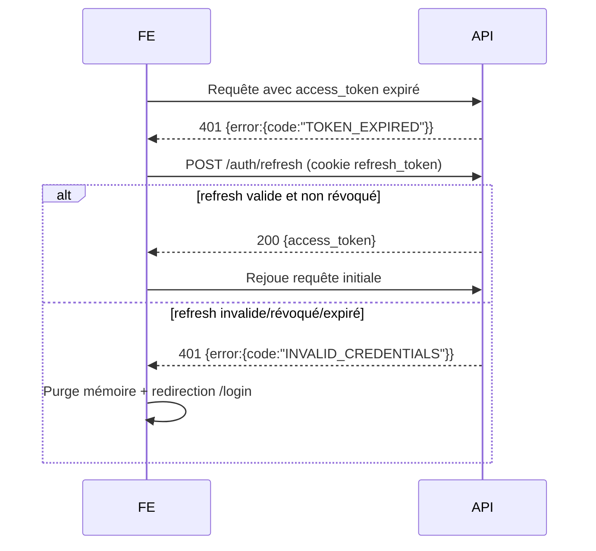

# 18. Sécurité

## 18.1 Modèle RBAC (Role-Based Access Control)

### 18.1.1 Rôles et permissions

| Rôle | Permissions clés (codes) |
|---|---|
| **ADMIN** | `users.manage`, `products.manage`, `discounts.approve`, `transfers.create`, `transfers.approve`, `reports.view_all`, `audit.view`, `ai.view`, `settings.manage` |
| **MAGASINIER** | `suppliers.manage`, `receptions.create`, `transfers.create`, `transfers.receive`, `inventories.manage` (dépôt), `stock.view` (dépôt) |
| **VENDEUR** | `sales.create`, `sales.view_own_branch`, `stock.view` (boutique de rattachement), `inventories.count` (boutique), `transfers.receive` (boutique) |

### 18.1.2 Matrice de permissions par endpoint (extrait)

| Endpoint | ADMIN | MAGASINIER | VENDEUR |
|---|---|---|---|
| `POST /products` | ✅ | ✅ | ❌ |
| `POST /transfers` | ✅ | ✅ | ❌ |
| `POST /transfers/{id}/receive` | ✅ | ✅ (dépôt) | ✅ (boutique destinataire uniquement) |
| `POST /sales` | ✅ | ❌ | ✅ (boutique de rattachement uniquement) |
| `POST /sales` avec `discount_rate > 0` | ✅ (auto-approuvé) | ❌ | ✅ **mais** `approved_by_user_id` doit référencer un ADMIN |
| `GET /audit` | ✅ | ❌ | ❌ |
| `GET /ai/*` | ✅ | ❌ (lecture restreinte) | ❌ |
| `GET /reports/dashboard` | ✅ (toutes boutiques) | ✅ (dépôt) | ✅ (sa boutique uniquement) |

### 18.1.3 Implémentation (décorateur Flask)

```python
def require_permission(permission_code: str):
    def decorator(fn):
        @wraps(fn)
        @jwt_required()
        def wrapper(*args, **kwargs):
            claims = get_jwt()
            if permission_code not in claims["permissions"]:
                AuditService.log("ACCESS_DENIED", entity="endpoint",
                                  user_id=claims["sub"],
                                  after={"endpoint": request.path, "permission": permission_code})
                raise ForbiddenError("FORBIDDEN")
            return fn(*args, **kwargs)
        return wrapper
    return decorator

@bp.route("/products", methods=["POST"])
@require_permission("products.manage")
def create_product():
    ...
```

## 18.2 Authentification JWT

| Élément | Politique |
|---|---|
| Access token | Durée de vie **15 minutes**, contient `sub` (user_id), `tenant_schema`, `role`, `permissions`, `branch_id` |
| Refresh token | Durée de vie **7 jours**, stocké en **cookie httpOnly, Secure, SameSite=Strict** |
| Rotation | Chaque refresh génère un nouveau refresh token (rotation) ; l'ancien est révoqué (liste noire Redis) |
| Révocation | À la déconnexion (`/auth/logout`), le refresh token est ajouté à une liste noire Redis (TTL = durée de vie restante) |
| Stockage côté client | Access token en mémoire (jamais en localStorage) ; refresh en cookie httpOnly (inaccessible en JS, donc protégé contre le XSS) |

## 18.3 Chiffrement des données

| Donnée | Mécanisme |
|---|---|
| Mots de passe | **bcrypt** (coût 12) ou **argon2id** — jamais stocké en clair (RNF-08) |
| Communications client ↔ serveur | **TLS 1.2+ obligatoire** via Nginx, redirection HTTP→HTTPS systématique (RNF-07) |
| Communications inter-conteneurs | Réseau Docker interne non exposé (cf. `08-ARCHITECTURE-TECHNIQUE.md` §8.5) |
| Sauvegardes | Chiffrement at-rest des dumps PostgreSQL (`gpg` ou chiffrement du volume de stockage) — cf. `25-DEPLOIEMENT-CICD.md` |
| Données sensibles en base | `solde_du`, `credit_score`, `password_hash` : accès restreint via RBAC, pas de chiffrement colonne supplémentaire jugé nécessaire au vu du chiffrement disque |

## 18.4 Protection des inputs / OWASP Top 10

| Risque OWASP | Mitigation |
|---|---|
| **Injection SQL** | ORM SQLAlchemy (requêtes paramétrées), aucune concaténation de chaînes SQL |
| **XSS** | React échappe par défaut le rendu (`dangerouslySetInnerHTML` interdit) ; en-têtes `Content-Security-Policy` stricts via Nginx |
| **CSRF** | API stateless JWT (pas de session cookie pour les requêtes mutantes) ; le refresh token en cookie httpOnly est protégé par `SameSite=Strict` + vérification de l'origine (`Origin`/`Referer`) sur `/auth/refresh` |
| **Broken Access Control** | RBAC systématique (décorateurs), tests d'intégration dédiés (cf. `24-PLAN-DE-TESTS.md`) |
| **Validation des entrées** | Schémas Marshmallow/Pydantic stricts sur chaque endpoint (types, bornes, enums — ex. `discount_rate IN {0,5,10,15,20}`) |
| **Exposition de données sensibles** | Sérialiseurs explicites (jamais `model.__dict__`), `password_hash` exclu de toute sérialisation |
| **Rate limiting** | Flask-Limiter sur `/auth/login` (ex. 5 tentatives / 15 min / IP) pour limiter le brute-force |
| **Logging & Monitoring** | Tous les échecs d'authentification et accès refusés sont journalisés (RG-34) |
| **Dépendances vulnérables** | `pip-audit` / `npm audit` intégrés au pipeline CI (cf. `25-DEPLOIEMENT-CICD.md`) |
| **Sécurité des en-têtes HTTP** | `Strict-Transport-Security`, `X-Content-Type-Options: nosniff`, `X-Frame-Options: DENY` via Nginx |

## 18.5 Gestion des tokens expirés (RG-36)



## 18.6 Sécurité multi-tenant

- Le `tenant_schema` est **dérivé du JWT côté serveur** (jamais transmis librement par le client) — empêche un utilisateur de basculer son `search_path` vers un autre tenant.
- Chaque requête SQL est exécutée après `SET search_path TO <tenant_schema>, public` (cf. `09-BACKEND-FLASK.md` §9.4) — isolation stricte au niveau base de données.
- Tests de sécurité dédiés : tentative d'accès croisé entre tenants (cf. `24-PLAN-DE-TESTS.md`, scénarios de sécurité).

## 18.7 Sécurité du mode offline

| Risque | Mitigation |
|---|---|
| Vol de l'appareil contenant l'IndexedDB | Les données locales ne contiennent **aucun mot de passe** ; l'accès à l'app nécessite un access token valide (durée 15 min) renouvelé périodiquement |
| Falsification d'une vente offline | Le serveur revalide intégralement les prix et le stock à la synchronisation — les prix ne sont **jamais** acceptés depuis le client, seuls `product_id` et `quantity` sont transmis, le prix est recalculé serveur |
| Rejeu d'une vente déjà synchronisée | `offline_uuid` UNIQUE garantit l'idempotence (RG-28) |

## 18.8 Synthèse des logs de sécurité (cf. `28-MONITORING-OBSERVABILITE.md`)

| Événement | Champ `event_type` |
|---|---|
| Connexion réussie | `LOGIN_SUCCESS` |
| Connexion échouée | `LOGIN_FAILED` |
| Déconnexion | `LOGOUT` |
| Accès refusé (RBAC) | `ACCESS_DENIED` |
| Remise appliquée | `DISCOUNT_APPLIED` |
| Modification de prix | `PRODUCT_PRICE_CHANGED` |
| Conflit de synchronisation | `SALE_CONFLICT` |
