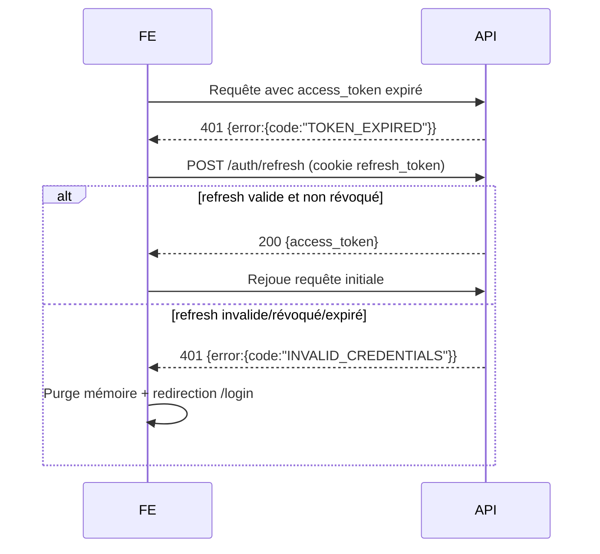

# 18. Sécurité

## 18.1 Modèle RBAC (Role-Based Access Control)

### 18.1.1 Rôles et permissions

| Rôle | Permissions clés (codes) |
|---|---|
| **ADMIN** | `users.manage`, `products.manage`, `discounts.approve`, `transfers.create`, `transfers.approve`, `reports.view_all`, `audit.view`, `ai.view`, `settings.manage` |
| **MAGASINIER** | `suppliers.manage`, `receptions.create`, `transfers.create`, `transfers.receive`, `inventories.manage` (dépôt), `stock.view` (dépôt) |
| **VENDEUR** | `sales.create`, `sales.view_own_branch`, `stock.view` (boutique de rattachement), `inventories.count` (boutique), `transfers.receive` (boutique) |

### 18.1.2 Matrice de permissions par endpoint (extrait)

| Endpoint | ADMIN | MAGASINIER | VENDEUR |
|---|---|---|---|
| `POST /products` | ✅ | ❌ | ❌ |
| `POST /transfers` | ✅ | ✅ | ❌ |
| `POST /transfers/{id}/receive` | ✅ | ✅ (dépôt) | ✅ (boutique destinataire uniquement) |
| `POST /sales` | ✅ | ❌ | ✅ (boutique de rattachement uniquement) |
| `POST /sales` avec `discount_rate > 0` | ✅ (`approved_by_id` requis) | ❌ | ✅ **mais** `approved_by_id` obligatoire (validé serveur → 422 sinon) |
| `GET /users` | ✅ | ❌ | ❌ |
| `GET /audit` | ✅ | ❌ | ❌ |
| `GET /analytics/*` | ✅ | ✅ | ✅ |
| `GET /reports/dashboard` | ✅ (toutes boutiques) | ✅ (dépôt) | ✅ (sa boutique uniquement) |

### 18.1.3 Implémentation (décorateur Flask — `app/utils/decorators.py`)

```python
def require_permission(*required_permissions: str):
    """Exige AU MOINS UNE des permissions listées.

    RF-05 : si le claim `must_change_password` est True, toutes les routes
    protégées retournent 403 PASSWORD_CHANGE_REQUIRED avant tout contrôle RBAC.
    """
    def decorator(fn):
        @wraps(fn)
        def wrapper(*args, **kwargs):
            verify_jwt_in_request()
            claims = get_jwt()

            # RF-05 — Forçage du changement de mot de passe côté backend
            if claims.get("must_change_password"):
                return jsonify({
                    "error": "PASSWORD_CHANGE_REQUIRED",
                    "message": "Changez votre mot de passe avant d'utiliser l'application.",
                }), 403

            user_permissions = set(claims.get("permissions", []))
            if "*" in user_permissions:          # ADMIN wildcard
                return fn(*args, **kwargs)
            if not user_permissions.intersection(required_permissions):
                raise forbidden(
                    "Cette action nécessite l'une des permissions : "
                    + ", ".join(required_permissions)
                )
            return fn(*args, **kwargs)
        return wrapper
    return decorator
```

**RF-05 — Changement de mot de passe obligatoire :**
- À la création d'un compte, `must_change_password=True` est positionné dans la table `users`.
- Le claim JWT `must_change_password` est inclus dans **chaque token** émis (login + refresh).
- Tant que `must_change_password=True`, toutes les routes protégées par `@require_permission` retournent `403 PASSWORD_CHANGE_REQUIRED`.
- Seul `POST /api/v1/auth/change-password` est accessible (il n'utilise pas `@require_permission`).
- À la réussite du changement, `must_change_password` passe à `False` en base → les tokens suivants auront le claim à `false`.


## 18.1bis Flask-Limiter — Protection brute-force

### Configuration

```python
# app/extensions.py
from flask_limiter import Limiter

def _get_real_ip():
    """IP réelle : priorité CF-Connecting-IP (Cloudflare) → X-Forwarded-For → remote_addr."""
    from flask import request
    return (
        request.headers.get("CF-Connecting-IP")
        or request.headers.get("X-Forwarded-For", "").split(",")[0].strip()
        or request.remote_addr
    )

limiter = Limiter(
    key_func=_get_real_ip,
    default_limits=[],       # pas de limite globale
    storage_uri="memory://", # compatible PythonAnywhere (pas de Redis)
)
```

### Limites appliquées

| Route | Limite | Justification |
|---|---|---|
| `POST /api/v1/auth/login` | 10 req/min + 50 req/h / IP | Protection brute-force passwords |
| `POST /api/v1/auth/register` | 3 req/h / IP | Limitation création comptes en masse |

### Comportement

- **Code HTTP 429** (`Too Many Requests`) retourné au dépassement
- **Réponse JSON** : `{"error": "RATE_LIMIT_EXCEEDED", "message": "..."}`
- **Stockage mémoire** : les compteurs sont réinitialisés au redémarrage de l'app (acceptable en mono-tenant). Sur VPS avec Redis, remplacer par `storage_uri="redis://localhost:6379"`.
- **En-tête `Retry-After`** inclus dans la réponse 429

### Note PythonAnywhere — Limitation connue

`storage_uri="memory://"` est **intentionnel** : PythonAnywhere ne fournit pas Redis.

**Limite honnête à connaître** : PythonAnywhere recharge l'application régulièrement (mise à jour code, redémarrage planifié). À chaque rechargement, tous les compteurs de rate limiting sont remis à zéro. Un attaquant persistant qui revient après un rechargement peut contourner la protection.

**Ce que cette protection fait** : bloquer les attaques brute-force simples et automatisées depuis une même IP sans pause.

**Ce qu'elle ne fait pas** : protéger contre un attaquant qui revient après le redémarrage de l'app, ou contre des attaques distribuées multi-IP.

**Amélioration possible en production réelle** : migrer vers un VPS avec Redis (`storage_uri="redis://localhost:6379"`) pour une protection persistante et multi-worker.

## 18.2 Authentification JWT

| Élément | Politique |
|---|---|
| Access token | Durée de vie **15 minutes**, contient `sub` (user_id), `tenant_schema`, `role`, `permissions`, `branch_id` |
| Refresh token | Durée de vie **7 jours**, stocké en **cookie httpOnly, Secure, SameSite=Strict** |
| Rotation | Chaque refresh génère un nouveau refresh token (rotation) ; l'ancien est révoqué (liste noire DB) |
| Révocation | À la déconnexion (`/auth/logout`), le JTI du refresh token est ajouté à `token_blocklist` (table SQL — pas de Redis requis) |
| Stockage côté client | Access token en mémoire (jamais en localStorage) ; refresh en cookie httpOnly (inaccessible en JS, donc protégé contre le XSS) |

## 18.3 Chiffrement des données

| Donnée | Mécanisme |
|---|---|
| Mots de passe | **bcrypt** (coût 12) ou **argon2id** — jamais stocké en clair (RNF-08) |
| Communications client ↔ serveur | **TLS 1.2+ obligatoire** via Nginx, redirection HTTP→HTTPS systématique (RNF-07) |
| Communications inter-conteneurs | Réseau Docker interne non exposé (cf. `08-ARCHITECTURE-TECHNIQUE.md` §8.5) |
| Sauvegardes | Chiffrement at-rest des dumps PostgreSQL (`gpg` ou chiffrement du volume de stockage) — cf. `25-DEPLOIEMENT-CICD.md` |
| Données sensibles en base | `solde_du`, `credit_score`, `password_hash` : accès restreint via RBAC, pas de chiffrement colonne supplémentaire jugé nécessaire au vu du chiffrement disque |

## 18.4 Protection des inputs / OWASP Top 10

| Risque OWASP | Mitigation |
|---|---|
| **Injection SQL** | ORM SQLAlchemy (requêtes paramétrées), aucune concaténation de chaînes SQL |
| **XSS** | React échappe par défaut le rendu (`dangerouslySetInnerHTML` interdit) ; en-têtes `Content-Security-Policy` stricts via Nginx |
| **CSRF** | API stateless JWT (pas de session cookie pour les requêtes mutantes) ; le refresh token en cookie httpOnly est protégé par `SameSite=Strict` + vérification de l'origine (`Origin`/`Referer`) sur `/auth/refresh` |
| **Broken Access Control** | RBAC systématique (décorateurs), tests d'intégration dédiés (cf. `24-PLAN-DE-TESTS.md`) |
| **Validation des entrées** | Schémas Marshmallow/Pydantic stricts sur chaque endpoint (types, bornes, enums — ex. `discount_rate IN {0,5,10,15,20}`) |
| **Exposition de données sensibles** | Sérialiseurs explicites (jamais `model.__dict__`), `password_hash` exclu de toute sérialisation |
| **Rate limiting** | Flask-Limiter 3.8.0 — `/auth/login` : 10 req/min + 50 req/h ; `/auth/register` : 3 req/h. IP réelle détectée via `CF-Connecting-IP → X-Forwarded-For → remote_addr`. Stockage `memory://` (compatible PythonAnywhere sans Redis). Code HTTP 429 en cas de dépassement. |
| **Logging & Monitoring** | Tous les échecs d'authentification et accès refusés sont journalisés (RG-34) |
| **Dépendances vulnérables** | `pip-audit` / `npm audit` intégrés au pipeline CI (cf. `25-DEPLOIEMENT-CICD.md`) |
| **Sécurité des en-têtes HTTP** | `Strict-Transport-Security`, `X-Content-Type-Options: nosniff`, `X-Frame-Options: DENY` via Nginx |

## 18.5 Gestion des tokens expirés (RG-36)



## 18.6 Sécurité multi-tenant

- Le `tenant_schema` est **dérivé du JWT côté serveur** (jamais transmis librement par le client) — empêche un utilisateur de basculer son `search_path` vers un autre tenant.
- Chaque requête SQL est exécutée après `SET search_path TO <tenant_schema>, public` (cf. `09-BACKEND-FLASK.md` §9.4) — isolation stricte au niveau base de données.
- Tests de sécurité dédiés : tentative d'accès croisé entre tenants (cf. `24-PLAN-DE-TESTS.md`, scénarios de sécurité).

## 18.7 Sécurité du mode offline

| Risque | Mitigation |
|---|---|
| Vol de l'appareil contenant l'IndexedDB | Les données locales ne contiennent **aucun mot de passe** ; l'accès à l'app nécessite un access token valide (durée 15 min) renouvelé périodiquement |
| Falsification d'une vente offline | Le serveur revalide intégralement les prix et le stock à la synchronisation — les prix ne sont **jamais** acceptés depuis le client, seuls `product_id` et `quantity` sont transmis, le prix est recalculé serveur |
| Rejeu d'une vente déjà synchronisée | `offline_uuid` UNIQUE garantit l'idempotence (RG-28) |

## 18.8 Synthèse des logs de sécurité (cf. `28-MONITORING-OBSERVABILITE.md`)

| Événement | Champ `event_type` |
|---|---|
| Connexion réussie | `LOGIN_SUCCESS` |
| Connexion échouée | `LOGIN_FAILED` |
| Déconnexion | `LOGOUT` |
| Accès refusé (RBAC) | `ACCESS_DENIED` |
| Remise appliquée | `DISCOUNT_APPLIED` |
| Modification de prix | `PRODUCT_PRICE_CHANGED` |
| Conflit de synchronisation | `SALE_CONFLICT` |
