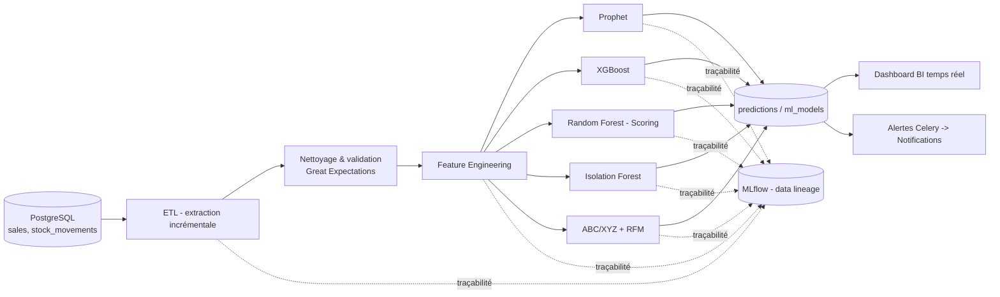

# 19. Module Analyse de données — Vue d'ensemble

## 19.1 Positionnement (option Analyse de données)

Ce module constitue le **cœur différenciant** du projet, conformément à l'option "Analyse de données" du mémoire. Il transforme les données opérationnelles (ventes, stocks, transferts) en **aide à la décision actionnable** pour l'administrateur.

## 19.2 Cas d'usage couverts

| Cas d'usage | Modèle / Technique | Document détaillé |
|---|---|---|
| Prévision de rupture de stock par produit/boutique | Prophet + XGBoost | `20-MACHINE-LEARNING.md` §20.2 |
| Scoring de solvabilité client (crédit informel) | Régression logistique / Random Forest | `20-MACHINE-LEARNING.md` §20.3 |
| Détection d'anomalies (ventes, remises, stock) | Isolation Forest | `20-MACHINE-LEARNING.md` §20.4 |
| Classification ABC/XYZ et recommandations de réapprovisionnement | pandas + règles métier | `20-MACHINE-LEARNING.md` §20.5 |
| Segmentation clients (RFM) | Clustering K-Means | `20-MACHINE-LEARNING.md` §20.3 |
| Tableau de bord décisionnel temps réel | WebSocket + Redis pub/sub | `22-DASHBOARD-BI.md` |

## 19.3 Source des données

| Source | Tables | Fréquence de rafraîchissement |
|---|---|---|
| Historique des ventes | `sales`, `sale_lines` | Continue (ETL incrémental quotidien) |
| Mouvements de stock | `stock_movements`, `stock` | Continue |
| Transferts | `transfers`, `transfer_lines` | Quotidienne |
| Clients | `customers` | À chaque transaction de crédit |
| Calendrier local | Référentiel statique (jours fériés BF, fêtes religieuses mobiles, saison des pluies juin-octobre) | Mise à jour annuelle |

### Données d'entraînement — particularités

Au stade du mémoire (avant déploiement réel), les modèles sont **entraînés et validés sur un jeu de données simulé** généré par un script (`ml/training/generate_synthetic_data.py`) qui reproduit :

- 24 mois d'historique de ventes pour ~200 produits sur 5 boutiques,
- une saisonnalité hebdomadaire (pic week-end) et annuelle (pics Tabaski, Noël/Nouvel An, saison des pluies juin-octobre pour les matériaux de construction),
- un bruit gaussien réaliste et quelques ruptures de stock historiques (pour entraîner la détection).

Ce jeu synthétique est documenté avec sa **méthode de génération, ses hypothèses et ses limites** (cf. `20-MACHINE-LEARNING.md` §20.6), permettant au jury d'évaluer la démarche même en l'absence de données réelles de production.

## 19.4 Pipeline global

Détails du pipeline ETL et de la traçabilité (data lineage) : `21-PIPELINE-ETL.md`.

## 19.5 Explicabilité (Explainability)

Pour chaque modèle, une justification est fournie à l'administrateur :

| Modèle | Méthode d'explicabilité |
|---|---|
| Prophet | Décomposition tendance / saisonnalité / résidus affichée graphiquement |
| XGBoost | SHAP values (top facteurs influençant la prévision : promotions, jour de la semaine, saison) |
| Random Forest (scoring crédit) | Importance des variables (feature importances) + SHAP individuel par client |
| Isolation Forest | Score d'anomalie + comparaison à la distribution normale (percentile) |

## 19.6 Indicateurs clés de performance (KPIs métier issus du module)

| KPI | Calcul | Affiché dans |
|---|---|---|
| Taux de rupture évitées | (ruptures anticipées et commandées à temps) / (ruptures totales prévues) | Dashboard |
| Taux de couverture du stock | stock disponible / demande prévue 30j | Dashboard |
| Taux de remise hors-norme détecté | anomalies remises / total remises | Dashboard, Audit |
| Score moyen de solvabilité | moyenne `credit_score` clients actifs | Dashboard |
| Valeur immobilis�