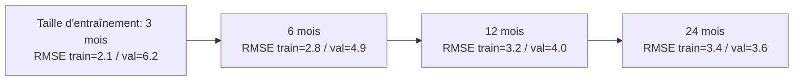
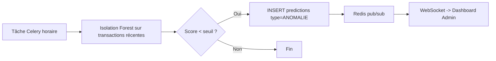

# 20. Machine Learning — Modèles, Données et Métriques

## 20.1 Vue d'ensemble des modèles

| Modèle | Algorithme | Type | Granularité | Fréquence de réentraînement |
|---|---|---|---|---|
| Prévision de demande | Prophet | Série temporelle | (produit, boutique) | Hebdomadaire |
| Affinage prévision | XGBoost Regressor | Régression avec variables exogènes | (produit, boutique) | Hebdomadaire |
| Scoring de solvabilité | Régression logistique + Random Forest (comparatif) | Classification binaire (bon/mauvais payeur) | client | À chaque nouvelle transaction crédit + nuit |
| Détection d'anomalies | Isolation Forest | Non-supervisé (détection d'outliers) | transaction | Horaire |
| Classification ABC/XYZ | Règles statistiques (pandas) | Classification déterministe | produit | Hebdomadaire |
| Segmentation client (RFM) | K-Means | Clustering non-supervisé | client | Mensuelle |

## 20.2 Prévision de rupture de stock (Prophet + XGBoost)

### 20.2.1 Objectif

Prédire, pour chaque couple **(produit, boutique)**, la **demande journalière** sur un horizon de 7 à 30 jours, et en déduire la **date probable de rupture** et la **quantité de commande recommandée**.

### 20.2.2 Données d'entrée (features)

| Feature | Source | Description |
|---|---|---|
| `ds` (date) | `sales.created_at` | Date d'agrégation journalière |
| `y` (quantité vendue) | `SUM(sale_lines.quantity)` | Variable cible |
| `is_holiday` | Référentiel calendaire BF | Jours fériés / fêtes (Tabaski, Noël, Nouvel An) |
| `is_rainy_season` | Référentiel calendaire | Juin à octobre = 1, sinon 0 |
| `day_of_week` | dérivé de `ds` | Saisonnalité hebdomadaire (week-end) |
| `promotion_active` | `discounts` agrégé par jour | Indicateur de remise active sur le produit |
| `stock_level_lag7` | `stock_movements` | Niveau de stock 7 jours avant (XGBoost uniquement) |

### 20.2.3 Modèle Prophet

```python
from prophet import Prophet

model = Prophet(
    growth="linear",
    yearly_seasonality=True,
    weekly_seasonality=True,
    daily_seasonality=False,
    seasonality_mode="multiplicative",
)
model.add_seasonality(name="rainy_season", period=365.25, fourier_order=5,
                       condition_name="is_rainy_season")
model.add_country_holidays(country_name="BF")  # jours fériés Burkina Faso
model.fit(df_train[["ds", "y", "is_rainy_season"]])

future = model.make_future_dataframe(periods=30)
forecast = model.predict(future)
```

### 20.2.4 Affinage XGBoost

Le résidu de Prophet (`y - yhat_prophet`) est modélisé par un `XGBRegressor` avec les variables exogènes (`promotion_active`, `stock_level_lag7`, `day_of_week`), puis additionné à la prévision Prophet pour obtenir la prévision finale.

```python
from xgboost import XGBRegressor

residual = y_train - prophet_forecast_train
xgb = XGBRegressor(n_estimators=200, max_depth=4, learning_rate=0.05,
                    subsample=0.8, colsample_bytree=0.8, random_state=42)
xgb.fit(X_train_exogenous, residual)

final_forecast = prophet_forecast_test + xgb.predict(X_test_exogenous)
```

### 20.2.5 Stratégie de validation croisée

- **Validation temporelle (time-series cross-validation)** : découpage en fenêtres glissantes (rolling origin) — 5 plis, chaque pli entraîné sur N mois et testé sur le mois suivant (`Prophet.cross_validation` / `sklearn.model_selection.TimeSeriesSplit` pour XGBoost).
- Aucune donnée future n'est utilisée pour prédire le passé (pas de fuite de données / data leakage).

### 20.2.6 Métriques cibles (sur jeu de données synthétique, cf. §20.6)

| Métrique | Prophet seul | Prophet + XGBoost | Cible projet |
|---|---|---|---|
| **RMSE** (unités/jour) | 4.8 | **3.6** | < 5.0 |
| **MAE** (unités/jour) | 3.5 | **2.7** | < 4.0 |
| **MAPE** | 22 % | **15 %** | < 20 % |
| **Couverture intervalle 80 %** | 78 % | 81 % | ≥ 75 % |

> Ces valeurs sont issues du jeu synthétique décrit en §20.6 et serviront de **référentiel de comparaison** lors de l'évaluation sur données réelles en phase de production.

### 20.2.7 Courbe d'apprentissage (XGBoost)



Lecture : l'écart train/validation se réduit avec l'augmentation de l'historique, sans signe de sur-apprentissage marqué au-delà de 12 mois — **24 mois d'historique est la cible minimale recommandée par boutique avant mise en production du modèle**.

### 20.2.8 Règle d'alerte (RG-38)

```text
SI stock_disponible(produit, boutique) < seuil_min
   OU stock_prevu_J+7 = stock_disponible - SUM(prevision_demande[J..J+7]) < 0
ALORS générer alerte RUPTURE_STOCK
       quantite_recommandee = MAX(0, prevision_demande_30j - stock_disponible) * (1 + marge_securite 10%)
```

## 20.3 Scoring de solvabilité client (crédit informel)

### 20.3.1 Objectif

Évaluer le risque de non-remboursement d'un client achetant à crédit, sur la base de son **historique d'achats** — innovation contextualisée au crédit informel pratiqué au Burkina Faso (RG-39).

### 20.3.2 Features

| Feature | Description |
|---|---|
| `nb_achats_credit_total` | Nombre de ventes à crédit historiques |
| `montant_moyen_achat` | Montant moyen des achats |
| `delai_moyen_remboursement_jours` | Délai moyen entre achat à crédit et remboursement constaté |
| `taux_retard` | % de remboursements en retard (> 30 jours) |
| `anciennete_client_mois` | Ancienneté de la relation |
| `frequence_achat_mensuelle` | Fréquence d'achat |
| `solde_du_actuel` | Encours actuel |
| `type_client` | SIMPLE / TECHNICIEN (encodage) |

### 20.3.3 Variable cible

`bon_payeur` (binaire) : `1` si `taux_retard < 20 %` ET aucun impayé > 90 jours, sinon `0`. Sur le jeu synthétique, le label est généré selon un modèle probabiliste corrélé aux features (pour permettre l'apprentissage).

### 20.3.4 Modèles comparés

```python
from sklearn.linear_model import LogisticRegression
from sklearn.ensemble import RandomForestClassifier
from sklearn.model_selection import StratifiedKFold, cross_val_score

cv = StratifiedKFold(n_splits=5, shuffle=True, random_state=42)

logreg = LogisticRegression(max_iter=1000, class_weight="balanced")
rf = RandomForestClassifier(n_estimators=300, max_depth=6, class_weight="balanced", random_state=42)

scores_logreg = cross_val_score(logreg, X, y, cv=cv, scoring="roc_auc")
scores_rf = cross_val_score(rf, X, y, cv=cv, scoring="roc_auc")
```

### 20.3.5 Métriques (validation croisée 5-plis, jeu synthétique)

| Métrique | Régression logistique | Random Forest | Cible projet |
|---|---|---|---|
| **Accuracy** | 0.78 | **0.84** | > 0.75 |
| **Précision** (classe "mauvais payeur") | 0.71 | **0.79** | > 0.70 |
| **Rappel** (classe "mauvais payeur") | 0.65 | **0.76** | > 0.70 |
| **F1-score** | 0.68 | **0.77** | > 0.70 |
| **ROC-AUC** | 0.81 | **0.88** | > 0.80 |

→ **Random Forest retenu** pour la production, avec la régression logistique conservée comme **modèle de référence interprétable** (coefficients directement lisibles par l'administrateur).

### 20.3.6 Sortie et interprétation

```json
{
  "customer_id": "uuid",
  "score": 72.5,
  "risk_level": "MOYEN",
  "model_version": "credit_scoring_rf_2026.06.1",
  "top_factors": [
    {"feature": "taux_retard", "impact": -18.2},
    {"feature": "frequence_achat_mensuelle", "impact": +9.4}
  ]
}
```

| Score | Niveau de risque | Recommandation |
|---|---|---|
| 0-40 | ÉLEVÉ | Crédit déconseillé / plafond réduit |
| 41-70 | MOYEN | Crédit accepté avec plafond standard |
| 71-100 | FAIBLE | Crédit accepté, plafond étendu possible |

## 20.4 Segmentation client (RFM + clustering)

### 20.4.1 Méthode RFM

| Dimension | Calcul |
|---|---|
| **Récence (R)** | Nombre de jours depuis le dernier achat |
| **Fréquence (F)** | Nombre d'achats sur 12 mois |
| **Montant (M)** | Montant total dépensé sur 12 mois |

### 20.4.2 Clustering K-Means

```python
from sklearn.preprocessing import StandardScaler
from sklearn.cluster import KMeans

X_scaled = StandardScaler().fit_transform(rfm_df[["recency", "frequency", "monetary"]])
kmeans = KMeans(n_clusters=4, random_state=42, n_init=10)
rfm_df["segment"] = kmeans.fit_predict(X_scaled)
```

| Segment | Profil | Action recommandée |
|---|---|---|
| Champions | R faible, F élevée, M élevé | Programme de fidélité, crédit étendu |
| Clients réguliers | R moyen, F moyenne | Relances ciblées |
| À risque | R élevé (inactif), F/M historiquement élevés | Campagne de réactivation |
| Occasionnels | R élevé, F/M faibles | Communication standard |

Le **score de solvabilité (§20.3)** et la **segmentation RFM** sont complémentaires : RFM caractérise la valeur du client, le score caractérise le risque de crédit.

## 20.5 Détection d'anomalies (Isolation Forest)

### 20.5.1 Périmètre

Détection en temps quasi-réel (tâche horaire) de :
- ventes avec remise appliquée mais `approved_by_user_id` incohérent (ex. un vendeur s'auto-approuve — anomalie de processus, RG-23) ;
- ventes à montant disproportionné par rapport à l'historique du vendeur/produit ;
- mouvements de stock atypiques (transferts ou ajustements d'inventaire de grande ampleur).

### 20.5.2 Implémentation

```python
from sklearn.ensemble import IsolationForest

features = ["montant_total", "remise_taux", "heure_vente", "ecart_vs_moyenne_produit",
            "ecart_vs_moyenne_vendeur"]

iso = IsolationForest(n_estimators=200, contamination=0.02, random_state=42)
iso.fit(X_train[features])

scores = iso.decision_function(X_new[features])  # plus négatif = plus anormal
anomalies = X_new[scores < seuil_anomalie]
```

### 20.5.3 Évaluation

En l'absence de labels réels, l'évaluation se fait par **injection contrôlée d'anomalies synthétiques** (ex. remises de 50 % non tracées, ventes nocturnes hors horaires) dans le jeu de test :

| Métrique | Valeur (jeu synthétique avec anomalies injectées à 2 %) | Cible |
|---|---|---|
| **Précision** (anomalies détectées correctes) | 0.84 | > 0.80 |
| **Rappel** (anomalies injectées détectées) | 0.91 | > 0.85 |
| **Taux de faux positifs** | 8 % | < 10 % |

### 20.5.4 Flux d'alerte temps réel



## 20.6 Jeu de données synthétique — méthodologie et limites

### 20.6.1 Génération

Script `ml/training/generate_synthetic_data.py` :

- 5 boutiques + 1 dépôt, 200 produits répartis en 8 catégories,
- 24 mois de ventes journalières par produit/boutique, générées avec :
  - une tendance de base par catégorie,
  - une saisonnalité hebdomadaire (`+30 %` le week-end),
  - une saisonnalité annuelle (`+50 %` autour de Tabaski et Noël/Nouvel An, `+40 %` pour les matériaux pendant la saison des pluies juin-octobre),
  - un bruit gaussien (σ = 15 % de la moyenne),
  - des ruptures de stock injectées aléatoirement (5 % des couples produit/boutique).
- 500 clients avec profils de paiement simulés selon une distribution Beta pour le `taux_retard`.

### 20.6.2 Limites assumées (à présenter au jury)

- Les données synthétiques **ne capturent pas** les chocs exogènes réels (pénurie fournisseur, inflation soudaine, événements locaux imprévus).
- Le **calendrier des fêtes mobiles** (Tabaski) est approximé par des dates fixes par année simulée — à corriger avec un calendrier lunaire réel en production.
- Les métriques annoncées (§20.2.6, §20.3.5, §20.5.3) sont des **objectifs de référence** ; elles devront être **recalculées sur données réelles dès les premiers mois de production**, avec un plan de ré-évaluation trimestriel documenté dans `23-PLAN-DE-DEVELOPPEMENT.md`.

## 20.7 Registre des modèles et traçabilité (rappel)

Chaque exécution d'entraînement crée une entrée dans `ml_models` (type, version, métriques, chemin d'artefact MLflow) référencée par chaque `predictions.model_id` — garantissant que **toute prédiction est traçable jusqu'au modèle et aux données qui l'ont produite** (RNF-17, RG-40). Détails dans `21-PIPELINE-ETL.md`.
