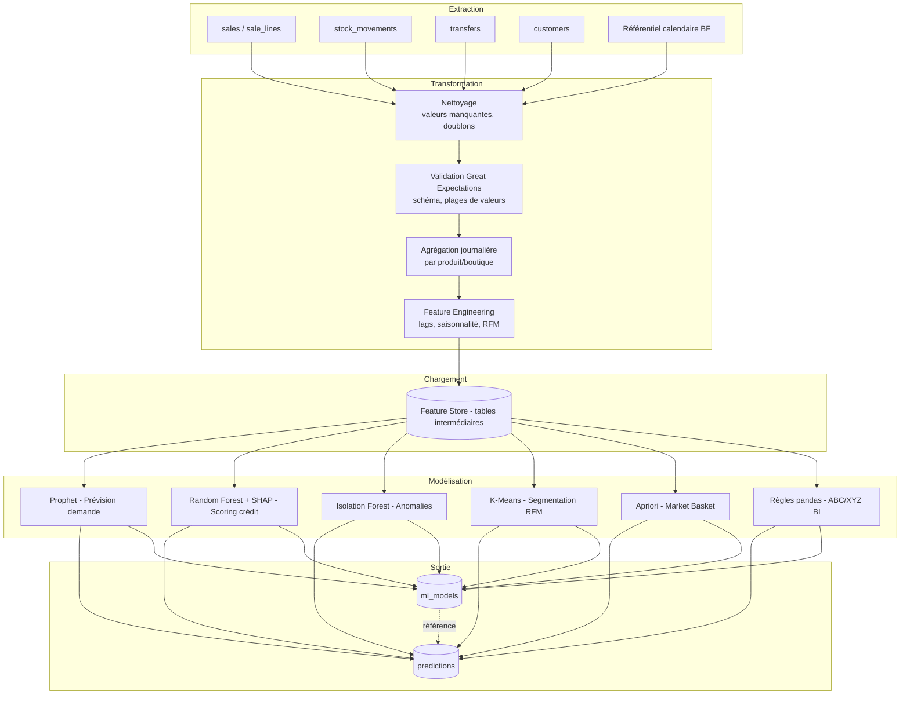

# 21. Pipeline ETL & Data Lineage

> **Dernière mise à jour :** 24 juin 2026 — orchestration cron PythonAnywhere (threads + cron_train_all.py) remplace Celery.

## 21.1 Objectif

Documenter le pipeline d'extraction, transformation et chargement (ETL) qui alimente le module IA, ainsi que le mécanisme de **traçabilité de bout en bout (data lineage)** exigé pour expliquer toute prédiction au jury (RNF-17).

## 21.2 Architecture du pipeline



## 21.3 Orchestration

> **Note PythonAnywhere** : Celery n'est pas disponible sur PythonAnywhere. L'orchestration est assurée par **threads Python** (entraînement à chaud via endpoint POST) et le script **`scripts/cron_train_all.py`** planifié depuis l'onglet *Tasks* de PythonAnywhere.

| Étape | Outil | Fréquence | Mécanisme réel (PythonAnywhere) |
|---|---|---|---|
| ETL complet (extract → validate → features) | pandas + SQLAlchemy | Quotidienne (02h00 UTC) | `cron_train_all.py` → CLI `flask etl-daily` |
| Entraînement Prophet | Prophet + scikit-learn | Quotidienne (02h00, après ETL) | `cron_train_all.py` → `compute_demand_forecast_task.run()` |
| Scoring crédit + SHAP | scikit-learn + shap | Quotidienne | `cron_train_all.py` → `compute_credit_scoring_task.run()` |
| Détection d'anomalies | Isolation Forest | Quotidienne | `cron_train_all.py` → `compute_anomaly_detection_task.run()` |
| RFM + K-optimal | K-Means + Silhouette | Quotidienne | `cron_train_all.py` → `compute_rfm_segmentation_task.run()` |
| ABC/XYZ | Règles déterministes | Quotidienne | `cron_train_all.py` → `compute_abc_xyz_task.run()` |
| Market Basket Apriori | mlxtend | Quotidienne (fenêtre 6 mois) | `cron_train_all.py` → `compute_market_basket_task.run()` |
| Entraînement manuel (endpoint) | Thread Python natif | À la demande | `POST /api/v1/analytics/ml/train/{type}` ou body JSON |

**Script cron (`scripts/cron_train_all.py`) :**
- Lance ETL puis tous les modèles ML dans l'ordre, dans un contexte Flask propre.
- En cas d'erreur sur une tâche, les suivantes continuent (pas de blocage en cascade).
- Log dans `logs/cron_train_all.log` ; exit code 1 si au moins une tâche a échoué (PythonAnywhere notifie l'échec par email).

**Commande PythonAnywhere (onglet Tasks, 02h00 UTC) :**
```
/home/<username>/.virtualenvs/gescom-bf/bin/python \
    /home/<username>/gescom-bf/scripts/cron_train_all.py
```

## 21.4 Règles de qualité des données (Great Expectations — extraits)

```python
import great_expectations as ge

suite = {
    "expect_column_values_to_not_be_null": ["product_id", "branch_id", "quantity"],
    "expect_column_values_to_be_between": [
        {"column": "quantity", "min_value": 0, "max_value": 10000},
        {"column": "unit_price_applied", "min_value": 0, "max_value": 1_000_000},
    ],
    "expect_column_values_to_be_in_set": [
        {"column": "price_type", "value_set": ["SIMPLE", "TECHNICIEN"]},
    ],
}
```

En cas d'échec de validation, l'étape suivante est **bloquée** et une alerte est envoyée à l'équipe technique (pas de propagation de données corrompues vers les modèles).

## 21.5 Data Lineage — traçabilité de bout en bout

### 21.5.1 Principe

Chaque prédiction stockée dans `predictions` référence :

1. `model_id` → `ml_models` (type, version, métriques, date d'entraînement, chemin MLflow),
2. les **identifiants des enregistrements sources** ayant contribué au jeu d'entraînement (plage de dates + liste des `sale_id` agrégés, stockée dans `ml_models.metrics.training_data_range`),
3. l'**horodatage de génération**.

### 21.5.2 Exemple de traçabilité d'une prédiction

```json
{
  "prediction_id": "uuid-pred-001",
  "type": "RUPTURE_STOCK",
  "product_id": "uuid-produit-vis-6mm",
  "branch_id": "uuid-boutique-tanghin",
  "model_id": "uuid-model-xgb-2026-06",
  "payload": {
    "predicted_stockout_date": "2026-06-21",
    "recommended_order_qty": 450,
    "confidence_interval": [380, 520]
  },
  "created_at": "2026-06-14T02:15:00Z"
}
```

```json
// ml_models correspondant
{
  "id": "uuid-model-xgb-2026-06",
  "type": "XGBOOST_STOCK",
  "version": "2026.06.1",
  "trained_at": "2026-06-08T03:00:00Z",
  "metrics": {
    "rmse": 3.6, "mae": 2.7, "mape": 0.15,
    "training_data_range": {"from": "2024-06-08", "to": "2026-06-07"},
    "cv_folds": 5
  },
  "artifact_path": "mlflow://models/xgboost_stock/2026.06.1"
}
```

### 21.5.3 MLflow Tracking

```python
import mlflow

with mlflow.start_run(run_name="xgboost_stock_2026_06"):
    mlflow.log_params({"n_estimators": 200, "max_depth": 4, "learning_rate": 0.05})
    mlflow.log_metrics({"rmse": rmse, "mae": mae, "mape": mape})
    mlflow.sklearn.log_model(xgb_model, "model")
    mlflow.set_tag("training_data_range", "2024-06-08/2026-06-07")
```

MLflow conserve : paramètres d'entraînement, métriques, artefact du modèle, et tags de traçabilité — consultables via l'UI MLflow par l'équipe technique, et résumés dans `ml_models.metrics` pour l'application métier.

### 21.5.4 Rejouabilité

Pour rejouer une prédiction passée (audit, explication d'une anomalie) :

1. Récupérer `ml_models.artifact_path` (modèle exact utilisé),
2. Récupérer `ml_models.metrics.training_data_range` (période de données d'entraînement),
3. Charger le modèle depuis MLflow et reproduire la prédiction sur les mêmes données d'entrée — garantissant la **reproductibilité scientifique** attendue par le jury.

## 21.6 Stratégie de reprise sur erreur

En cas d'échec d'une étape du pipeline (validation Great Expectations, erreur d'entraînement, timeout) :

| Scénario | Comportement |
|---|---|
| Échec validation qualité | Pipeline interrompu, données corrompues non propagées, alerte admin |
| Échec entraînement ML | Ancien modèle conservé en production (`ml_models.status = ACTIVE` inchangé), alerte `MLPredictionStale` après 36h |
| Timeout entraînement (> 10 min) | Thread abandonné, log d'erreur, `/health` reflète le nb de modèles actifs restants |
| Erreur DB lors de cron | Exception loguée dans `cron_train_all.py`, tâche suivante tentée au prochain cycle |

> Le système est **fail-safe** : aucune prédiction erronée n'est préférée à l'absence de prédiction. En cas de doute, le dernier modèle valide est maintenu.
