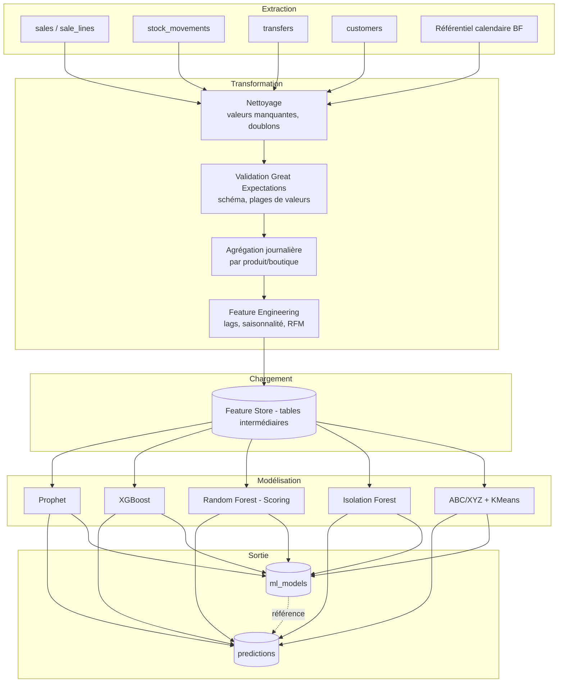

# 21. Pipeline ETL & Data Lineage

## 21.1 Objectif

Documenter le pipeline d'extraction, transformation et chargement (ETL) qui alimente le module IA, ainsi que le mécanisme de **traçabilité de bout en bout (data lineage)** exigé pour expliquer toute prédiction au jury (RNF-17).

## 21.2 Architecture du pipeline



## 21.3 Orchestration

| Étape | Outil | Fréquence | Tâche Celery |
|---|---|---|---|
| Extraction + nettoyage | pandas + SQLAlchemy | Quotidienne (02h00) | `etl_extract_and_clean` |
| Validation qualité | Great Expectations | Quotidienne (après extraction) | `etl_validate` |
| Feature engineering | pandas | Quotidienne | `etl_build_features` |
| Entraînement Prophet/XGBoost | scikit-learn / Prophet | Hebdomadaire (dimanche 03h00) | `recompute_stock_predictions` |
| Scoring crédit | scikit-learn | Quotidienne + à chaque vente crédit | `recompute_credit_scores` |
| Détection d'anomalies | scikit-learn | Horaire | `run_anomaly_detection` |
| ABC/XYZ + RFM | pandas + scikit-learn | Hebdomadaire | `compute_abc_xyz`, `compute_rfm_segments` |

## 21.4 Règles de qualité des données (Great Expectations — extraits)

```python
import great_expectations as ge

suite = {
    "expect_column_values_to_not_be_null": ["product_id", "branch_id", "quantity"],
    "expect_column_values_to_be_between": [
        {"column": "quantity", "min_value": 0, "max_value": 10000},
        {"column": "unit_price_applied", "min_value": 0, "max_value": 1_000_000},
    ],
    "expect_column_values_to_be_in_set": [
        {"column": "price_type", "value_set": ["SIMPLE", "TECHNICIEN"]},
    ],
}
```

En cas d'échec de validation, l'étape suivante est **bloquée** et une alerte est envoyée à l'équipe technique (pas de propagation de données corrompues vers les modèles).

## 21.5 Data Lineage — traçabilité de bout en bout

### 21.5.1 Principe

Chaque prédiction stockée dans `predictions` référence :

1. `model_id` → `ml_models` (type, version, métriques, date d'entraînement, chemin MLflow),
2. les **identifiants des enregistrements sources** ayant contribué au jeu d'entraînement (plage de dates + liste des `sale_id` agrégés, stockée dans `ml_models.metrics.training_data_range`),
3. l'**horodatage de génération**.

### 21.5.2 Exemple de traçabilité d'une prédiction

```json
{
  "prediction_id": "uuid-pred-001",
  "type": "RUPTURE_STOCK",
  "product_id": "uuid-produit-vis-6mm",
  "branch_id": "uuid-boutique-tanghin",
  "model_id": "uuid-model-xgb-2026-06",
  "payload": {
    "predicted_stockout_date": "2026-06-21",
    "recommended_order_qty": 450,
    "confidence_interval": [380, 520]
  },
  "created_at": "2026-06-14T02:15:00Z"
}
```

```json
// ml_models correspondant
{
  "id": "uuid-model-xgb-2026-06",
  "type": "XGBOOST_STOCK",
  "version": "2026.06.1",
  "trained_at": "2026-06-08T03:00:00Z",
  "metrics": {
    "rmse": 3.6, "mae": 2.7, "mape": 0.15,
    "training_data_range": {"from": "2024-06-08", "to": "2026-06-07"},
    "cv_folds": 5
  },
  "artifact_path": "mlflow://models/xgboost_stock/2026.06.1"
}
```

### 21.5.3 MLflow Tracking

```python
import mlflow

with mlflow.start_run(run_name="xgboost_stock_2026_06"):
    mlflow.log_params({"n_estimators": 200, "max_depth": 4, "learning_rate": 0.05})
    mlflow.log_metrics({"rmse": rmse, "mae": mae, "mape": mape})
    mlflow.sklearn.log_model(xgb_model, "model")
    mlflow.set_tag("training_data_range", "2024-06-08/2026-06-07")
```

MLflow conserve : paramètres d'entraînement, métriques, artefact du modèle, et tags de traçabilité — consultables via l'UI MLflow par l'équipe technique, et résumés dans `ml_models.metrics` pour l'application métier.

### 21.5.4 Rejouabilité

Pour rejouer une prédiction passée (audit, explication d'une anomalie) :

1. Récupérer `ml_models.artifact_path` (modèle exact utilisé),
2. Récupérer `ml_models.metrics.training_data_range` (période de données d'entraînement),
3. Charger le modèle depuis MLflow et reproduire la prédiction sur les mêmes données d'entrée — garantissant la **reproductibilité scientifique** attendue par le jury.

## 21.6 Schéma du Feature Store (tables intermédiaires)

| Table intermédiaire | Contenu | Rafraîchissement |
|---|---|---|
| `fs_daily_sales` | Ventes agrégées par jour/produit/boutique + features calendaires | Quotidien |
| `fs_customer_rfm` | RFM par client | Mensuel |
| `fs_customer_credit_features` | Features de scoring crédit par client | Quotidien |
| `fs_transaction_features` | Features de détection d'anomalies (fenêtre glissante 30j) | Horaire |

> Ces tables résident dans le schéma tenant et sont purgées/recalculées (pas de conservation longue) — seules les sorties (`predictions`) sont conservées pour analyse historique.
