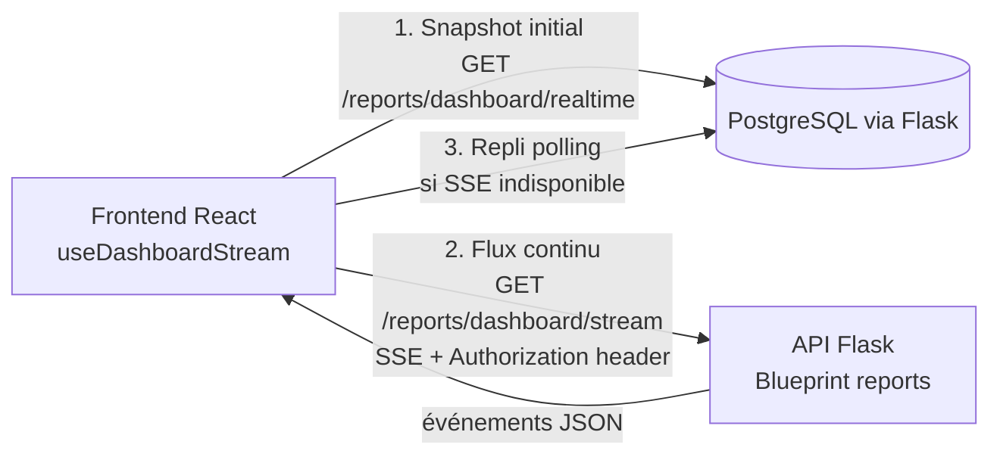

# 22. Dashboard BI / Tableau de bord décisionnel

## 22.1 Objectifs du tableau de bord

- Donner à l'administrateur une **vue temps réel** de l'activité (ventes, stock, marges) consolidée et par boutique.
- Afficher les **alertes IA** (ruptures prévues, anomalies, clients à risque) de façon actionnable.
- Permettre l'**export Excel / PDF** des rapports pour archivage / présentation (RF-29).

## 22.2 Architecture temps réel (SSE + polling de repli)



La décision technique d'utiliser **Server-Sent Events (SSE)** plutôt que WebSocket répond à deux contraintes projet :

- L'en-tête `Authorization: Bearer <token>` (JWT, RG-36) **ne peut pas être envoyé par l'API `EventSource`** du navigateur, qui ne supporte pas les en-têtes personnalisés. Le flux SSE est donc consommé via `fetch()` + `ReadableStream` avec l'en-tête d'autorisation.
- PythonAnywhere (uWSGI synchrone) ne supporte pas le streaming long. Le backend détecte `DISABLE_SSE=true` et émet un unique snapshot avant de fermer la connexion ; le frontend détecte l'événement `sse-disabled` et bascule automatiquement sur le polling pur.

### 22.2.1 Endpoints SSE / temps réel

| Endpoint | Méthode | Description |
|---|---|---|
| `GET /reports/dashboard/realtime` | REST classique | Snapshot instantané des KPIs (charge initiale + polling de repli) |
| `GET /reports/dashboard/stream` | SSE (`text/event-stream`) | Flux continu d'événements JSON, 1 événement toutes les `DASHBOARD_STREAM_INTERVAL_SECONDS` secondes (défaut : 5 s), max `DASHBOARD_STREAM_MAX_EVENTS` (défaut : 60) |

### 22.2.2 Format des événements SSE

```
event: dashboard
data: {"sales_today_total":"127500.00","sales_today_count":12,"average_basket":"10625.00","low_stock_count":3,"top_products_today":[...]}

event: sse-disabled
data: {}
```

L'événement `sse-disabled` signale le mode mono-shot (PythonAnywhere). Le client bascule ensuite sur le polling.

## 22.3 Implémentation frontend (`useDashboardStream`)

Le hook `frontend/src/features/dashboard/hooks/useDashboardStream.ts` implémente la stratégie SSE + repli polling :

```
Séquence de démarrage (par effet React)
1. Snapshot immédiat  →  reportsApi.realtime()           → mise à jour de l'état
2. connectStream()    →  connexion SSE (fetch + ReadableStream)
3. poll()             →  boucle polling de fond (active uniquement si isLiveRef = false)
```

### 22.3.1 Correction du bug React 18 Strict Mode (closures locales)

En mode `StrictMode`, React monte les effets **deux fois de suite** (mount → unmount → mount) pour détecter les effets de bord. L'utilisation d'un `useRef` comme variable de contrôle de boucle créait une condition de concurrence :

| Approche (incorrecte) | Comportement |
|---|---|
| `const activeRef = useRef(false)` | La référence est partagée entre les deux invocations. La première invocation est nettoyée (`ref.current = false`), puis la seconde l'écrase avec `true`. Les boucles async de la **première** invocation voient `true` et **continuent** — deux connexions SSE concurrentes. |

**Correction appliquée** : variable de fermeture (*closure*) **locale** à chaque invocation :

```typescript
useEffect(() => {
  let isActive = true;   // locale à cette invocation — indépendante des autres

  return () => {
    isActive = false;    // n'affecte que cette invocation, pas la suivante
    abortController?.abort();
  };
}, [accessToken, branchId]);
```

### 22.3.2 Proxy Vite SSE (`timeout: 0`)

Sans configuration explicite, le proxy HTTP de Vite ferme les connexions SSE après ~2 minutes, ce qui provoque une boucle de reconnexions rapides et des flux concurrents. Correction dans `frontend/vite.config.ts` :

```typescript
proxy: {
  "/api": {
    target: process.env.VITE_API_PROXY_TARGET || "http://localhost:5000",
    changeOrigin: true,
    timeout: 0,   // désactive le timeout — requis pour les flux SSE longs
  },
},
```

## 22.4 Sections du tableau de bord

| Section | Contenu | Source |
|---|---|---|
| **KPIs globaux** | CA du jour, nombre de ventes, panier moyen, produits en stock faible | `GET /reports/dashboard/summary` |
| **Top produits du jour** | 5 produits les plus vendus (quantité) | `top_products_today` dans la réponse summary |
| **Alertes stock** | Produits dont `stock.quantity ≤ product.min_stock_threshold` | Join SQLAlchemy `Stock ⟕ Product` |
| **Alertes anomalies** | Transactions signalées | `predictions` (type ANOMALIE), flux SSE |
| **Crédit clients** | Clients avec `credit_balance > 0` | `GET /sales/credits` |
| **ABC/XYZ** | Répartition des produits par classe | `GET /analytics/abc-xyz` |

## 22.5 Schéma de la réponse (`DashboardSummary`)

```yaml
/reports/dashboard/summary:
  get:
    summary: Snapshot KPIs du tableau de bord
    responses:
      '200':
        content:
          application/json:
            schema:
              type: object
              properties:
                sales_today_total:
                  type: string
                  description: CA du jour (Decimal en chaîne, FCFA)
                sales_today_count:
                  type: integer
                  description: Nombre de ventes du jour
                average_basket:
                  type: string
                  description: Panier moyen du jour (Decimal en chaîne)
                low_stock_count:
                  type: integer
                  description: Nombre de références sous min_stock_threshold
                top_products_today:
                  type: array
                  items:
                    type: object
                    properties:
                      product_id: { type: string, format: uuid }
                      name: { type: string }
                      sku: { type: string }
                      quantity_sold: { type: integer }
```

## 22.6 Maquette du dashboard

```text
┌─────────────────────────────────────────────────────────────────┐
│ GesCom-BF        [Entreprise X]      🔔 3 alertes    👤 Admin     │
├─────────────────────────────────────────────────────────────────┤
│ ┌────────────┐ ┌────────────┐ ┌────────────┐ ┌────────────┐     │
│ │ CA jour    │ │ Nb ventes  │ │ Panier moy │ │ Stock bas  │     │
│ │ 127 500 F  │ │     12     │ │  10 625 F  │ │     3      │     │
│ └────────────┘ └────────────┘ └────────────┘ └────────────┘     │
├─────────────────────────────────────────────────────────────────┤
│ Top produits du jour             │  Alertes stock                │
│ [Tableau 5 produits]             │  ⚠ Vis 6mm  — stock : 2/min 10│
│                                  │  ⚠ Ciment   — stock : 0/min 5  │
├─────────────────────────────────────────────────────────────────┤
│ Encours clients                  │  Classification ABC/XYZ        │
│ [Liste credit_balance > 0]       │  [Graphique classes A/B/C]    │
└─────────────────────────────────────────────────────────────────┘
```

## 22.7 Export des rapports (RF-29)

| Rapport exportable | Endpoint | Format |
|---|---|---|
| Export stock complet | `GET /reports/stock/export` | Excel (.xlsx via openpyxl) |
| Journal d'audit | `GET /users/audit-logs` (paginé) | JSON (mise en forme côté client) |
| Rapport de ventes (période) | À venir | PDF (WeasyPrint / Jinja2) |

## 22.8 Variables d'environnement liées au dashboard temps réel

| Variable | Défaut | Description |
|---|---|---|
| `DISABLE_SSE` | `false` | `true` = mode mono-shot (PythonAnywhere/uWSGI). Le frontend détecte l'événement `sse-disabled` et bascule sur polling. |
| `DASHBOARD_STREAM_INTERVAL_SECONDS` | `5` | Intervalle entre deux événements SSE (secondes). |
| `DASHBOARD_STREAM_MAX_EVENTS` | `60` | Nombre max d'événements avant fermeture propre du flux (≈ 5 min avec l'intervalle de 5 s). Le client se reconnecte automatiquement après 5 s. |

## 22.9 Visualisations recommandées (bibliothèques)

| Visualisation | Librairie | Données |
|---|---|---|
| Courbes d'évolution CA/marge | Recharts | `sales` agrégées par jour |
| Treemap ABC/XYZ | D3.js | `predictions` (ABC_XYZ) |
| Diagramme en secteurs RFM | Recharts | `fs_customer_rfm` |
| Jauge couverture stock | Recharts (RadialBarChart) | `stock.quantity` vs `product.min_stock_threshold` |
