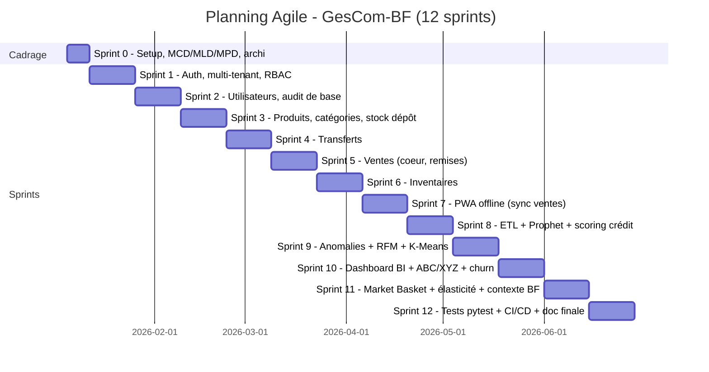

# 23. Plan de développement — Méthodologie Agile

> **Dernière mise à jour :** 1er juillet 2026 — mise à jour conformité code v2.

## 23.1 Méthodologie retenue

**Scrum**, adapté à un projet académique en solo/petite équipe :

- Sprints de **2 semaines**.
- Rôles : Product Owner (encadreur académique / vision projet), Scrum Master + Développeur (étudiant), Parties prenantes (jury, utilisateurs pilotes).
- Cérémonies : Sprint Planning (début de sprint), Daily (auto-suivi journalier via journal de bord), Sprint Review (démonstration), Sprint Retrospective (amélioration continue).
- Outils : backlog géré dans un board Kanban (GitHub Projects / Trello), code versionné Git (GitFlow simplifié : `main`, `develop`, `feature/*`).

## 23.2 Backlog produit — Epics

| Epic | RF associées | Sprints |
|---|---|---|
| E1 — Socle technique & Authentification | RF-01 à RF-05, RNF-07 à RNF-09 | Sprint 1-2 |
| E2 — Catalogue & Référentiels | RF-06 à RF-10 | Sprint 2-3 |
| E3 — Stock, Dépôt & Transferts | RF-11 à RF-14 | Sprint 3-4 |
| E4 — Ventes (cœur métier) | RF-15 à RF-19 | Sprint 4-5 |
| E5 — Mode Offline-First (PWA) | RF-20, RNF-10 | Sprint 6-7 |
| E6 — Inventaires | RF-21 à RF-23 | Sprint 5-6 |
| E7 — Rapports & Dashboard | RF-24, RF-29 | Sprint 9-10 |
| E8 — Module analytique & IA | RF-25 à RF-36 | Sprint 8-11 |
| E9 — Audit & Sécurité avancée | RF-30 à RF-32 | Sprint 2, continu |
| E10 — Multi-tenant SaaS | - | Sprint 1, 11 |
| E11 — Tests, CI/CD, Documentation finale | RNF-14, RNF-15 | Continu + Sprint 12 |

**E8 détail** : Prévision demande (Prophet), scoring crédit (RF+SHAP), anomalies enrichies, segmentation RFM+churn, Market Basket (Apriori), élasticité prix (régression log-log), indicateurs contexte africain BF, K-optimal auto-sélectionné, `data_confidence`, /health, Sentry, ABC/XYZ (BI), 155 tests pytest (127 unitaires ML + 17 intégration API + 15 sécurité RBAC + 12 RBAC rôles), pipeline CI/CD GitHub Actions.

## 23.3 Planning des sprints (12 sprints = 24 semaines ≈ 6 mois)

## 23.4 Détail des sprints — livrables

| Sprint | Objectif | Livrables | Definition of Done |
|---|---|---|---|
| 0 | Cadrage | MCD/MLD/MPD, architecture, environnement Docker | Schéma validé, `docker-compose up` fonctionnel |
| 1 | Authentification & multi-tenant | Login JWT, RBAC, schema-per-tenant | Tests d'intégration auth passants, isolation tenant vérifiée |
| 2 | Utilisateurs & audit | CRUD utilisateurs/rôles, table `audit_logs` | Toute action critique journalisée |
| 3 | Produits & stock dépôt | CRUD produits, réceptions fournisseurs, stock dépôt | Contraintes prix (RG-08 à RG-10) testées |
| 4 | Transferts | Création/réception transferts | Cycle d'état complet testé (BROUILLON→RECU) |
| 5 | Ventes | Saisie vente, remises encadrées, crédit | RG-22/RG-23/RG-25 testées |
| 6 | Inventaires | Comptage, écarts, ajustements | RG-33 testée |
| 7 | PWA offline | Service Worker, IndexedDB, sync | Scénario coupure réseau démontré |
| 8 | ETL + prévisions + scoring | Pipeline ETL, Prophet (jours fériés BF), Random Forest + SHAP | Métriques RMSE/MAE documentées, SHAP fonctionnel |
| 9 | Anomalies + RFM + K-Means | Isolation Forest (raisons enrichies), K-Means auto-k, Silhouette/Elbow | 4 segments stables, raisons lisibles |
| 10 | Dashboard BI + ABC/XYZ + churn | Tableau de bord temps réel, ABC/XYZ BI, churn heuristique, /health | Dashboards fonctionnels |
| 11 | Market Basket + élasticité + contexte BF | Apriori, régression log-log, indicateurs africains, K-optimal, `data_confidence`, Sentry, Flask-Limiter | Tous les endpoints analytics opérationnels | ✅
| 12 | Tests + CI/CD + doc soutenance | 155 tests pytest passants (127 unitaires ML + 17 intégration API + 15 sécurité RBAC + 12 RBAC rôles), pipeline CI bloque sur échec, docs actualisées | CI verte, 155/155 tests, documentation `docs/` complète | ✅

## 23.5 Suivi d'avancement (exemple de tableau de burndown)

| Sprint | Story points planifiés | Story points réalisés | Vélocité cumulée |
|---|---|---|---|
| 1 | 20 | 18 | 18 |
| 2 | 18 | 18 | 36 |
| 3 | 22 | 20 | 56 |
| ... | ... | ... | ... |

> Ce tableau est à compléter au fil du projet réel et présenté en soutenance pour démonstrer la démarche itérative (mesure de vélocité, ajustement du backlog).

## 23.6 Définition des rôles dans l'équipe (projet académique)

| Rôle Scrum | Porteur | Responsabilité |
|---|---|---|
| Product Owner | Encadreur / vision métier | Priorisation backlog, validation des incréments |
| Développeur Full-Stack & Data | Étudiant (porteur du projet) | Développement backend, frontend, modèles IA |
| Scrum Master | Étudiant (auto-organisation) | Suivi du planning, gestion des blocages |
| Utilisateurs pilotes | Quincaillerie partenaire (si disponible) | Retours UX, validation terrain (UC-11, écran caissier) |

## 23.7 Gestion des risques projet

| Risque | Probabilité | Impact | Mitigation |
|---|---|---|---|
| Absence de données réelles pour entraîner les modèles IA | Élevée | Moyen | Jeu de donn