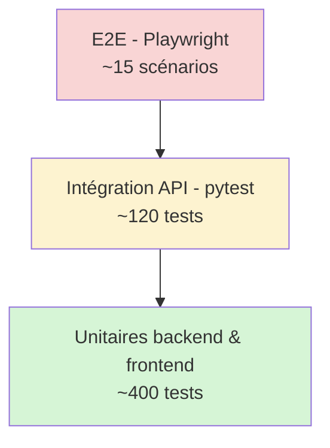

# 24. Plan de tests

## 24.1 Stratégie générale

| Niveau | Outils | Objectif | Couverture cible |
|---|---|---|---|
| Tests unitaires backend | pytest + pytest-cov | Services, règles de gestion, modèles | ≥ 80 % |
| Tests d'intégration backend | pytest + base de test (Docker PostgreSQL) | Endpoints API, RBAC, multi-tenant | Tous les endpoints critiques |
| Tests unitaires frontend | Jest + React Testing Library | Composants, hooks, logique offline | ≥ 80 % |
| Tests end-to-end (E2E) | Playwright | Parcours utilisateur complets | Scénarios clés (UC-01, UC-11, UC-14) |
| Tests de modèles ML | pytest + scikit-learn metrics | Non-régression des métriques (RMSE, AUC, etc.) | Seuils définis en `20-MACHINE-LEARNING.md` |
| Tests de sécurité | pytest + scénarios dédiés | RBAC, isolation multi-tenant, injection | Scénarios OWASP prioritaires |
| Tests de charge | Locust | Performance sous charge (RNF-01 à RNF-06) | p95 < 200 ms à 2000 ventes/jour simulées |

## 24.2 Pyramide de tests



## 24.3 Scénarios de tests clés (backend)

### Authentification & sécurité

| ID | Scénario | Résultat attendu |
|---|---|---|
| T-AUTH-01 | Connexion avec identifiants valides | 200, tokens générés |
| T-AUTH-02 | Connexion avec mot de passe erroné | 401 `INVALID_CREDENTIALS`, log `LOGIN_FAILED` |
| T-AUTH-03 | Requête avec access token expiré | 401 `TOKEN_EXPIRED` |
| T-AUTH-04 | Refresh token révoqué après logout | 401 sur tentative de refresh |
| T-SEC-01 | Vendeur du tenant A tente d'accéder à une donnée du tenant B | 404 (donnée invisible, isolation schema) |
| T-SEC-02 | Vendeur tente d'appeler `GET /audit` | 403 `FORBIDDEN` |
| T-SEC-03 | Injection SQL dans le paramètre `search` de `/products` | Aucune exécution malveillante (requête paramétrée) |

### Règles de gestion — Ventes

| ID | Scénario | Règle | Résultat attendu |
|---|---|---|---|
| T-SALE-01 | Vente avec `discount_rate=12` (hors liste) | RG-22 | 400 `VALIDATION_ERROR` |
| T-SALE-02 | Vente avec `discount_rate=10` sans `approved_by_user_id` | RG-23 | 422 `DISCOUNT_APPROVAL_REQUIRED` |
| T-SALE-03 | Vente avec quantité > stock disponible (en ligne) | RG-24 | 409 `INSUFFICIENT_STOCK` |
| T-SALE-04 | Tentative de modification d'une vente `VALIDEE` | RG-27 | 409 `SALE_IMMUTABLE` |
| T-SALE-05 | Vente à crédit sans `customer_id` | RG-26 | 422 `CREDIT_REQUIRES_CUSTOMER` |
| T-SALE-06 | Vente technicien : `unit_price_applied` = `technician_price` | RG-21 | Prix correct appliqué et historisé |

### Stock & Transferts

| ID | Scénario | Règle | Résultat attendu |
|---|---|---|---|
| T-STK-01 | Transfert avec quantité > stock dépôt | RG-18 | 409 `INSUFFICIENT_STOCK` |
| T-STK-02 | Transfert dépôt→boutique passage `EN_TRANSIT` | RG-17 | Stock dépôt décrémenté, stock boutique inchangé |
| T-STK-03 | Réception transfert `EN_TRANSIT`→`RECU` | RG-17 | Stock boutique incrémenté |
| T-STK-04 | Inventaire avec écart > 5 % sans justification | RG-33 | 400 `VALIDATION_ERROR` |

### Synchronisation offline

| ID | Scénario | Règle | Résultat attendu |
|---|---|---|---|
| T-SYNC-01 | Sync d'une vente offline avec stock suffisant | RG-29 | Statut `VALIDEE` |
| T-SYNC-02 | Sync d'une vente offline avec stock devenu insuffisant | RG-29/RG-30 | Statut `EN_CONFLIT`, alerte admin |
| T-SYNC-03 | Rejeu de la même `offline_uuid` | RG-28 | Statut `DEJA_SYNCHRONISE`, pas de doublon |

## 24.4 Scénarios E2E (Playwright)

| ID | Parcours | Couverture |
|---|---|---|
| E2E-01 | Connexion → Dashboard → Déconnexion | UC-01, UC-02 |
| E2E-02 | Création produit → Réception fournisseur → Stock dépôt mis à jour | UC-07, RF-11 |
| E2E-03 | Transfert dépôt→boutique → Réception → Stock boutique mis à jour | UC-08, UC-09 |
| E2E-04 | Vente complète avec remise 10 % approuvée | UC-11, UC-12 |
| E2E-05 | **Vente en mode hors-ligne** (simulation coupure réseau via Playwright `context.setOffline(true)`) → reconnexion → synchronisation | UC-14 |
| E2E-06 | Inventaire : comptage avec écart > 5 % → justification obligatoire | UC-10, RG-33 |
| E2E-07 | Consultation dashboard et alertes IA (prévision rupture) | UC-15, UC-16 |

## 24.5 Tests des modèles Machine Learning

| Test | Description | Seuil de non-régression |
|---|---|---|
| `test_prophet_xgboost_rmse` | Vérifie RMSE sur jeu de validation | < 5.0 (cf. `20-MACHINE-LEARNING.md` §20.2.6) |
| `test_credit_scoring_roc_auc` | Vérifie ROC-AUC du modèle Random Forest | > 0.80 |
| `test_isolation_forest_recall` | Vérifie le rappel sur anomalies injectées | > 0.85 |
| `test_model_lineage` | Vérifie que chaque `prediction` référence un `model_id` valide avec métriques | 100 % des prédictions tracées |
| `test_no_data_leakage` | Vérifie que `TimeSeriesSplit`/`cross_validation` ne mélange pas passé/futur | Aucune fuite détectée |

> Ces tests sont exécutés en CI sur le jeu de données synthétique (cf. `20-MACHINE-LEARNING.md` §20.6) ; un job séparé recalcule les métriques sur données réelles une fois en production.

## 24.6 Tests de charge (Locust)

```python
from locust import HttpUser, task, between

class VendeurUser(HttpUser):
    wait_time = between(1, 3)

    @task(5)
    def create_sale(self):
        self.client.post("/api/v1/sales", json={...}, headers=self.auth_header)

    @task(2)
    def get_stock(self):
        self.client.get("/api/v1/stock?branch_id=...", headers=self.auth_header)
```

| Scénario | Charge simulée | Objectif (RNF-01, RNF-04) |
|---|---|---|
| Pic de ventes (heures d'affluence) | 2 000 ventes/jour réparties sur 8h → ~70 req/min | p95 < 200 ms |
| Lecture catalogue/stock | 500 req/min | p95 < 200 ms (cache Redis) |
| Synchronisation offline en masse (retour réseau après coupure) | 200 ventes synchronisées en lot | Traitement < 30 s |

## 24.7 Intégration continue (extrait pipeline)

```yaml
# .github/workflows/ci.yml (extrait)
jobs:
  backend-tests:
    steps:
      - run: pip install -r requirements.txt
      - run: pytest --cov=app --cov-fail-under=80
  frontend-tests:
    steps:
      - run: npm ci
      - run: npm run test -- --coverage --coverageThreshold='{"global":{"branches":80,"functions":80,"lines":80}}'
  e2e-tests:
    steps:
      - run: npx playwright test
  security-scan:
    steps:
     