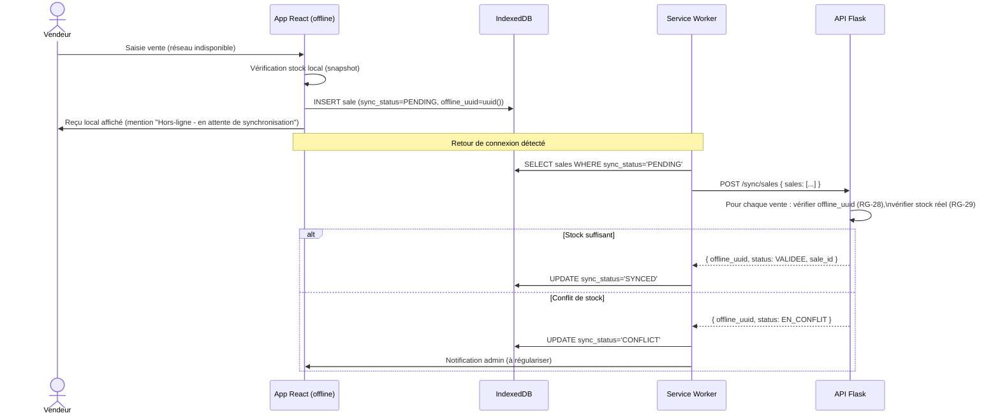

# 26. Gestion du mode Offline-First (PWA)

## 26.1 Objectif et enjeu métier

De nombreuses boutiques en zone périurbaine/rurale subissent des **coupures réseau fréquentes**. Le module de caisse (UC-11) doit rester **pleinement opérationnel hors-ligne** : recherche produit, application de remises encadrées, encaissement, impression/affichage de reçu — avec **synchronisation différée** dès le retour de connexion (RF-20, RNF-10, RG-28 à RG-30).

## 26.2 Architecture PWA

```mermaid
flowchart TB
    subgraph "Navigateur (poste de caisse)"
        UI[React App]
        SW[Service Worker\n(Workbox)]
        IDB[(IndexedDB\nvia Dexie.js)]
        SQ[File de synchronisation\n'sync_queue']
    end

    subgraph "Backend"
        API[API Flask]
        PG[(PostgreSQL)]
    end

    UI -->|lecture catalogue/stock| IDB
    UI -->|écriture vente| IDB
    IDB --> SQ
    SW -->|cache assets statiques\n(app shell)| UI
    SW -->|Background Sync API| SQ
    SQ -->|POST /sync/sales (par lot)| API
    API --> PG
    API -->|réponse statut sync| SQ
```

## 26.3 Composants techniques

| Composant | Rôle | Technologie |
|---|---|---|
| **App Shell** | Interface utilisable sans réseau (HTML/CSS/JS) | Service Worker (Workbox `precache`) |
| **Cache catalogue** | Produits, prix, stock (snapshot) disponibles offline | IndexedDB via Dexie.js, rafraîchi périodiquement en ligne |
| **File de synchronisation** | Ventes créées offline, en attente d'envoi | Table IndexedDB `sync_queue` |
| **Détecteur de connexion** | Indicateur visuel + déclencheur de sync | `navigator.onLine` + `online`/`offline` events |
| **Background Sync** | Tentative de sync automatique au retour réseau | Service Worker `Background Sync API` (fallback : sync manuelle au focus de l'app) |

## 26.4 Modèle de données local (IndexedDB / Dexie.js)

```typescript
// src/offline/db.ts
import Dexie, { Table } from 'dexie';

export interface CachedProduct {
  id: string;
  name: string;
  barcode: string;
  simple_price: number;
  technician_price: number;
  stock_quantity: number;
  updated_at: string;
}

export interface OfflineSale {
  offline_uuid: string;       // généré côté client (UUID v4)
  branch_id: string;
  cashier_id: string;
  lines: OfflineSaleLine[];
  discount_rate: number | null;
  customer_id: string | null;
  payment_type: 'CASH' | 'CREDIT';
  created_at_local: string;   // horodatage poste de caisse
  sync_status: 'PENDING' | 'SYNCING' | 'SYNCED' | 'CONFLICT';
}

export interface OfflineSaleLine {
  product_id: string;
  quantity: number;
  unit_price_applied: number;
}

export class GesComDB extends Dexie {
  products!: Table<CachedProduct, string>;
  sales!: Table<OfflineSale, string>;

  constructor() {
    super('gescom_bf_offline');
    this.version(1).stores({
      products: 'id, barcode, name',
      sales: 'offline_uuid, sync_status, created_at_local',
    });
  }
}

export const db = new GesComDB();
```

## 26.5 Cycle de vie d'une vente offline



## 26.6 Stratégie de résolution des conflits (RG-29, RG-30)

| Type de conflit | Détection | Résolution |
|---|---|---|
| **Stock insuffisant à la synchronisation** | Le stock réel (mis à jour par d'autres ventes synchronisées entre-temps) est inférieur à la quantité vendue offline | Vente marquée `EN_CONFLIT`, stock mis en **négatif contrôlé** (RG-30) + alerte admin pour régularisation manuelle (ajustement, avoir partiel, réapprovisionnement) |
| **Doublon de synchronisation** (rejeu réseau) | `offline_uuid` déjà connu côté serveur | Réponse idempotente : statut `DEJA_SYNCHRONISE`, aucune nouvelle écriture (RG-28) |
| **Remise nécessitant approbation, approbateur hors-ligne** | `discount_rate` ≥ 10 % sans `approved_by_user_id` valide au moment de la sync | Vente synchronisée avec statut `EN_ATTENTE_APPROBATION` ; admin doit valider a posteriori |
| **Produit supprimé/modifié entre la mise en cache et la synchronisation** | `product_id` introuvable ou prix très différent | Vente synchronisée avec `unit_price_applied` figé (valeur saisie offline, conformément à RG-27 immutabilité), signalée pour revue |

> **Principe directeur** : aucune vente saisie par le vendeur n'est rejetée silencieusement. Tout conflit aboutit à un enregistrement traçable (`EN_CONFLIT` / `EN_ATTENTE_APPROBATION`) visible dans le tableau de bord administrateur (`22-DASHBOARD-BI.md`), jamais à une perte de donnée.

## 26.7 Synchronisation du catalogue (sens serveur → client)

| Élément synchronisé | Fréquence | Mécanisme |
|---|---|---|
| Catalogue produits + prix | À la connexion + toutes les 30 min si en ligne | `GET /products?updated_since=<timestamp>` (synchronisation incrémentale) |
| Stock de la boutique | À la connexion + toutes les 15 min si en ligne | `GET /stock?branch_id=...&updated_since=...` |
| Taux de remise autorisés (RG-22) | À la connexion | `GET /discounts/rates` (mis en cache, change rarement) |

> Le **stock affiché offline est un instantané** — il peut diverger du stock réel si plusieurs caisses vendent simultanément hors-ligne. C'est ce décalage qui motive la stratégie de résolution de conflits ci-dessus (RG-29).

## 26.8 Indicateurs visuels pour le vendeur (UX)

| Indicateur | État | Description |
|---|---|---|
| Pastille de connexion | 🟢 En ligne | Stock et prix garantis à jour |
| Pastille de connexion | 🟡 Hors-ligne | Mention "Vente enregistrée localement, sera synchronisée" |
| Badge file d'attente | `N ventes en attente de synchronisation` | Visible par le vendeur et l'admin |
| Bannière conflit | "X ventes nécessitent une vérification" | Visible uniquement par l'admin (dashboard) |

## 26.9 Service Worker — exemple de configuration (Workbox)

```javascript
// vite.config.ts (extrait plugin PWA)
VitePWA({
  registerType: 'autoUpdate',
  workbox: {
    runtimeCaching: [
      {
        urlPattern: /\/api\/v1\/products/,
        handler: 'NetworkFirst',
        options: { cacheName: 'products-cache', networkTimeoutSeconds: 3 },
      },
      {
        urlPattern: /\.(?:png|jpg|svg|woff2)$/,
        handler: 'CacheFirst',
        options: { cacheName: 'static-assets' },
      },
    ],
  },
  manifest: {
    name: 'GesCom-BF',
    short_name: 'GesCom',
    display: 'standalone',
    background_color: '#ffffff',
    theme_color: '#0f766e',
    icons: [{ src: '/icons/icon-192.png', sizes: '192x192', type: 'image/png' }],
  },
});
```

## 26.10 Limites assumées et perspectives

- Le mode offline couvre la **vente au comptoir** (UC-11) ; les opérations de gestion (réceptions, transferts, inventaires) nécessitent une connexion (compromis de complexité, documenté comme hors-périmètre V1 dans `01-INTRODUCTION.md`).
- La taille du cache IndexedDB est dimensionnée pour ~20 000 produits (RNF-05) ; au-delà, une stratégie de pagination/cache partiel par c