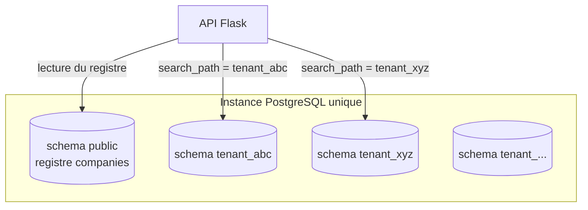
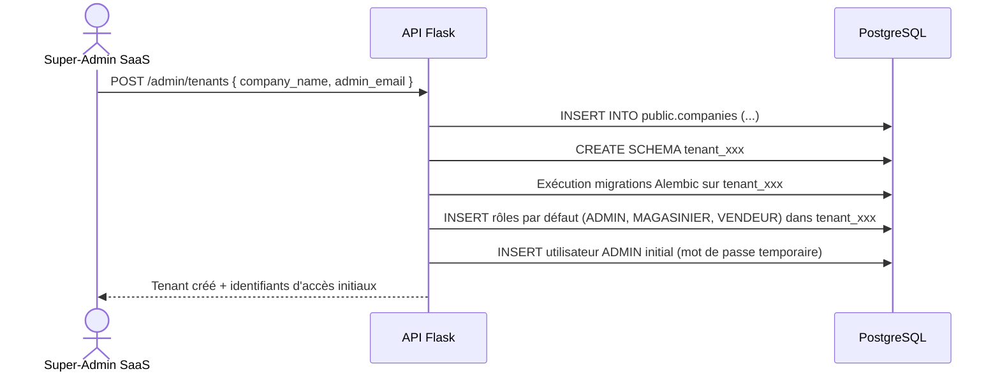
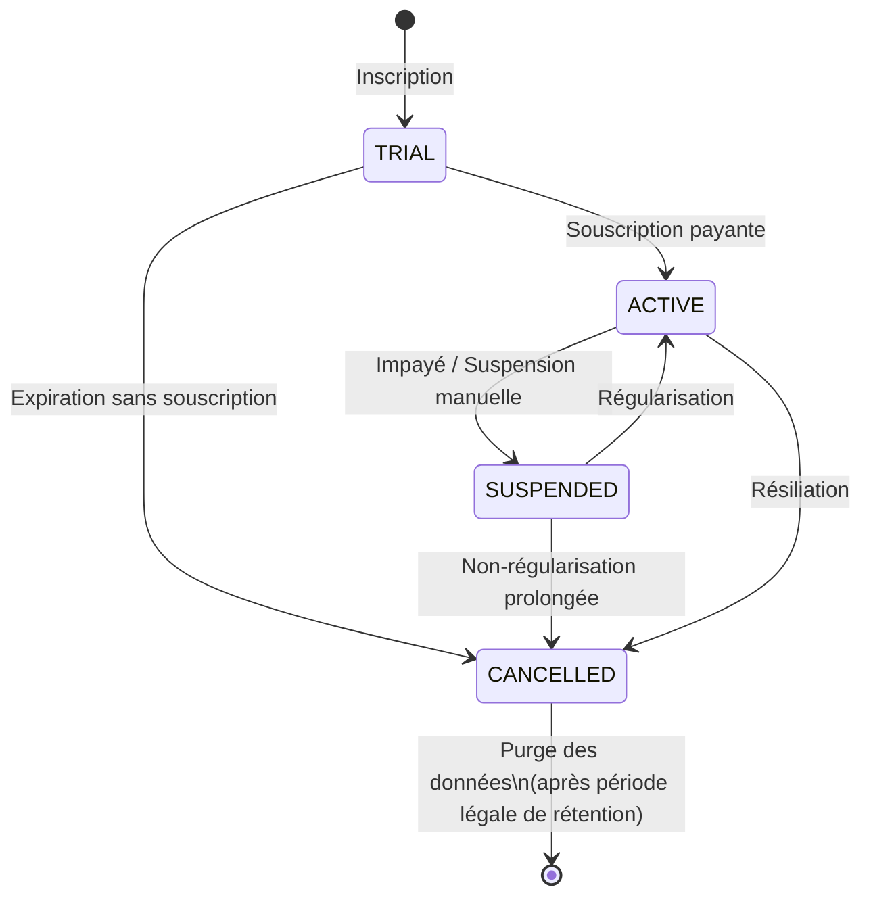

# 27. Modèle SaaS Multi-tenant

## 27.1 Positionnement

GesCom-BF est conçu pour être exploité par **plusieurs entreprises clientes (tenants)** indépendantes. Ce chapitre détaille le modèle SaaS multi-tenant cible (V2 PostgreSQL) et le mode mono-tenant actif en production (V1 MySQL / PythonAnywhere).

**Statut par environnement :**

| Environnement | Base de données | Mode | Statut |
|---|---|---|---|
| Dev local (Docker Compose) | PostgreSQL 16 | Multi-tenant | ✅ Actif |
| **Production (PythonAnywhere)** | **MySQL 8.0** | **Mono-tenant** | ✅ **Actif** |
| VPS / Cloud futur | PostgreSQL 16 | Multi-tenant | 🔜 Planifié V2 |

> Sur PythonAnywhere (MySQL), `POST /api/v1/companies/register` retourne `503 MULTI_TENANT_UNAVAILABLE`. Le provisioning multi-tenant est désactivé dans `app/services/tenant_provisioning.py` par détection du dialecte MySQL.

## 27.2 Stratégie d'isolation : schema-per-tenant

| Stratégie possible | Description | Choix |
|---|---|---|
| Base de données dédiée par tenant | Isolation maximale, coût d'exploitation élevé | ❌ Trop lourd pour le volume cible (RNF-06 : jusqu'à 200 tenants) |
| Schéma PostgreSQL dédié par tenant (**retenu**) | Isolation forte au niveau logique, une seule instance PostgreSQL, migrations reproductibles | ✅ |
| Colonne `tenant_id` partagée (multi-tenant à plat) | Risque de fuite de données inter-tenant en cas de bug applicatif (oubli de filtre) | ❌ Risque sécurité trop élevé (RG-41) |



## 27.3 Registre central (schéma `public`)

La table `public.companies` (définie en `14-MPD.md`) sert de **registre des tenants** :

| Colonne | Rôle |
|---|---|
| `id` | Identifiant unique de l'entreprise cliente |
| `schema_name` | Nom du schéma PostgreSQL dédié (ex. `tenant_abc`) |
| `subscription_plan` | Plan d'abonnement (cf. §27.5) |
| `subscription_status` | `ACTIVE`, `SUSPENDED`, `TRIAL`, `CANCELLED` |
| `subscription_expires_at` | Date d'expiration / renouvellement |
| `created_at` | Date de création du tenant |

## 27.4 Provisioning d'un nouveau tenant



**Script de provisioning** (extrait) :

```python
# scripts/provision_tenant.py
def provision_tenant(company_name: str, admin_email: str) -> Company:
    schema_name = f"tenant_{slugify(company_name)}"
    company = Company(name=company_name, schema_name=schema_name,
                       subscription_plan="TRIAL", subscription_status="TRIAL")
    db.session.add(company)
    db.session.commit()

    db.session.execute(f"CREATE SCHEMA IF NOT EXISTS {schema_name}")
    run_migrations(schema=schema_name)          # cf. 25-DEPLOIEMENT-CICD.md §25.5
    seed_default_roles_and_permissions(schema_name)
    create_initial_admin_user(schema_name, admin_email)
    return company
```

## 27.5 Plans d'abonnement (proposition de modèle économique)

| Plan | Cible | Limites | Tarification indicative* |
|---|---|---|---|
| **TRIAL** | Découverte (14 jours) | 1 boutique, 50 produits, fonctions de base | Gratuit |
| **STANDARD** | Petite quincaillerie mono-site | 1 dépôt + 2 boutiques, 5 utilisateurs, dashboard de base | À définir avec le porteur de projet |
| **PRO** | Réseau multi-boutiques | Boutiques illimitées, module IA complet (prévisions, scoring, anomalies), exports PDF | À définir |
| **ENTERPRISE** | Grand réseau / franchise | SLA dédié, support prioritaire, API étendue | Sur devis |

> *La tarification n'est pas un livrable technique de ce projet académique — elle est indiquée à titre de **piste de modèle économique** pour la soutenance (axe « perspectives de valorisation »), à affiner avec une étude de marché complémentaire (`02-ETUDE-DU-MARCHE.md`).

## 27.6 Application des limites de plan

| Limite | Mécanisme d'application |
|---|---|
| Nombre de boutiques | Vérification dans `BranchService.create_branch()` : `COUNT(branches) < plan.max_branches` |
| Nombre d'utilisateurs | Vérification dans `UserService.create_user()` |
| Accès au module IA | Middleware `require_plan(["PRO", "ENTERPRISE"])` sur les Blueprints `ai` et `analytics` |
| Compte suspendu (`subscription_status=SUSPENDED`) | Middleware global renvoie `403 SUBSCRIPTION_INACTIVE` avant toute autre vérification |

```python
# app/middleware/subscription.py (extrait)
def check_subscription(f):
    @wraps(f)
    def wrapper(*args, **kwargs):
        company = get_current_company()
        if company.subscription_status in ("SUSPENDED", "CANCELLED"):
            raise ApiError("SUBSCRIPTION_INACTIVE", 403)
        if company.subscription_status == "TRIAL" and company.subscription_expires_at < datetime.utcnow():
            raise ApiError("TRIAL_EXPIRED", 403)
        return f(*args, **kwargs)
    return wrapper
```

## 27.7 Middleware de résolution du tenant (rappel et complément)

Le middleware `set_tenant_schema` (introduit en `09-BACKEND-FLASK.md`) résout le tenant à partir du **claim `company_schema` du JWT** :

```python
@app.before_request
def set_tenant_schema():
    if request.endpoint in PUBLIC_ENDPOINTS:  # /auth/login, /health, etc.
        return
    claims = get_jwt()
    schema = claims.get("company_schema")
    if not schema or not schema.startswith("tenant_"):
        raise ApiError("INVALID_TENANT_CONTEXT", 403)
    db.session.execute(text("SET search_path TO :schema, public"), {"schema": schema})
```

**Exceptions au flux normal** :

| Endpoint | Comportement tenant |
|---|---|
| `/admin/tenants/*` (réservé Super-Admin SaaS) | Opère sur le schéma `public` uniquement, jamais sur un schéma tenant |
| `/auth/login` | Recherche l'utilisateur dans **tous les schémas tenants actifs** via une table d'index `public.user_index (email, schema_name)` maintenue par trigger, afin d'éviter un scan de tous les schémas |

## 27.8 Cycle de vie d'un tenant



## 27.9 Considérations de montée en charge (RNF-06)

| Aspect | Approche |
|---|---|
| 200 tenants × ~20 000 produits | Index par schéma (cf. `14-MPD.md`), pas de table partagée géante — chaque schéma reste de taille gérable |
| Connexions PostgreSQL | Pool de connexions partagé (PgBouncer recommandé en perspective V2) pour éviter l'épuisement de connexions avec de nombreux schémas |
| Migrations | Script séquentiel `migrate_all_tenants.py` (cf. `25-DEPLOIEMENT-CICD.md`) — pour > 200 tenants, paralléliser par lots |
| Tâches Celery planifiées (ETL, IA) | Itération par tenant actif, avec limitation de concurrence pour éviter la saturation CPU lors des entraînements hebdomadaires |

## 27.10 Synthèse : ce que le multi-tenant apporte au projet

- **Valorisation SaaS** : un seul socle technique peut servir plusieurs quincailleries clientes, modèle économique récurrent (abonnement).
- **Isolation et sécurité** : chaque client a la garantie contractuelle que ses données ne sont jamais visibles par un autre (RG-41, `18-SECURITE.md` §multi-tenant).
- **Exploitation mutualisée** : sauvegardes, monitoring et mises à jour gérés une seule fois pour tous les tenants (`25-DEPLOIEMENT-CICD.md`, `28-MONITORING-OBSERVABILITE.md`).
